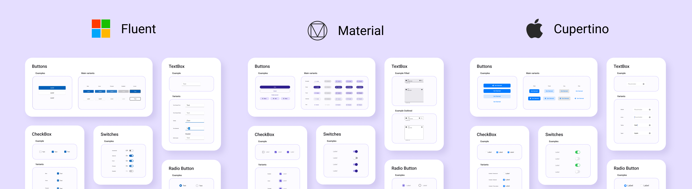

# Uno.Themes

  

`Uno.Themes` is the repo for add-ons NuGet packages that can be added to any new or existing Uno solution.

It contains two libraries:

- **`Uno Material`** library is designed to help you use [Material Design 3](https://m3.material.io/)
- **`Uno Cupertino`** library is designed to help you use [Cupertino - Human Interface Guideline styling](https://developer.apple.com/design/human-interface-guidelines/).

Both libraries include:

- Color system for both Light and Dark theme
- Styles for existing WinUI controls like Buttons, TextBox, etc.

Platform support:

- WinUI / UWP
- iOS
- macOS
- Android
- WebAssembly
- Linux (Skia.Gtk)

## Packages

Package|Stable|Preview
-|-|-
Uno.Material||
Uno.Material.WinUI||
Uno.Cupertino||
Uno.Cupertino.WinUI||

## Getting Started

See the complete [documentation](#documentation) for starting with this library.

For a larger example and features demo, visit the [Uno Gallery](https://github.com/unoplatform/uno.gallery) repository.

## Documentation

All documentation for `Uno.Themes` can be found on our [website](https://platform.uno/docs/articles/external/uno.themes/doc/themes-overview.html).

## Contributing

Please read our [contributing guide](CONTRIBUTING.md) to learn about our development process and how to propose bug fixes and improvements.
Come visit us on our [Discord Channel #uno-platform](https://discord.gg/eBHZSKG) for help on how to contribute!

Contribute to Uno in your browser using [GitPod.io](https://gitpod.io), follow [our guide here](https://platform.uno/docs/articles/features/working-with-gitpod.html).

Be also mindful of our [Code of Conduct](CODE_OF_CONDUCT.md).

## Acknowledgments

- [Uno Platform](https://platform.uno)
- [Material Design 3](https://m3.material.io/)
- [Material Design](https://material.io/design)
- [Material Design In XAML](https://github.com/MaterialDesignInXAML) as inspiration for UWP ripple effect.
- [Cupertino - Human Interface Guideline styling](https://developer.apple.com/design/human-interface-guidelines)
- [ShowMeTheXaml](https://github.com/Keboo/ShowMeTheXAML) for code snippets. Through [our Fork](https://github.com/unoplatform/ShowMeTheXAML)
- [WinUI](https://microsoft.github.io/microsoft-ui-xaml/)

## License

This project is licensed under the Apache 2.0 license -- see the
[LICENSE](LICENSE) file for details.

## Contributors

Thanks go to these wonderful people (List made with [contrib.rocks](https://contrib.rocks)):

💖 Thank you.
