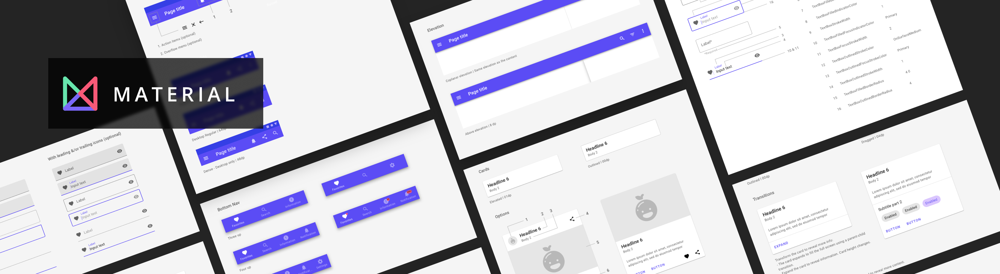



This library is designed to help you use the [material design system](https://material.io/design).
It includes :
- Color system for both Light and Dark theme
- Styles for existing WinUI controls like Buttons, TextBox, etc.
- Custom Controls for Material Components not offered out of the box by WinUI, such as Card and BottomNavigationBar.

Quickly visualize all the available controls through this [zeplin link](https://zpl.io/scene/bzgq8wG)

Platform support:
- WinUI / UWP
- iOS
- MacOS
- Android
- WebAssembly
- Linux (Skia.Gtk)


Uno Material Design Guideline is a resource for designers and software developers that combines Material and Uno design guidance in single document. It is an easy way to kickstart design and implementation of cross-platform experiences with unified Material design system look and feel, using Sketch and Uno Platform.

Download the [Uno Platform Design Guidelines sketch file](./design/Uno-Platform-Design-Guidelines.sketch) to get started.

It includes:
- Uno-Material components
- Uno type resource names
- Uno asset naming and export guidance

<!-- TODO : Insert build status, nuget.org badge, etc -->
[](LICENSE)

## Getting Started

1. Install the nuget package Uno.Material.
2. Unless you want our default color palette (inspired by our Uno logo), you'll want to override the following color resources in you application. We suggest creating a ColorPaletteOverride.xaml `ResourceDictionary`.
For more information on the color system, consult this [page](https://material.io/design/color/the-color-system.html#color-theme-creation) for all the official documentation and tools to help you create your own palette.
Here is what ColorPaletteOverride.xaml would contain if you want both light and dark theme.
```xaml
<ResourceDictionary
    xmlns="http://schemas.microsoft.com/winfx/2006/xaml/presentation"
    xmlns:x="http://schemas.microsoft.com/winfx/2006/xaml">

	<!--

	For more information on the color system, consult this page
	https://material.io/design/color/the-color-system.html#color-theme-creation

	-->
	<ResourceDictionary.ThemeDictionaries>
		<!-- Light Theme -->
		<ResourceDictionary x:Key="Light">
			<Color x:Key="MaterialPrimaryColor">#5B4CF5</Color>
			<Color x:Key="MaterialPrimaryVariantDarkColor">#353FE5</Color>
			<Color x:Key="MaterialPrimaryVariantLightColor">#B6A8FB</Color>
			<Color x:Key="MaterialSecondaryColor">#67E5AD</Color>
			<Color x:Key="MaterialSecondaryVariantDarkColor">#2BB27E</Color>
			<Color x:Key="MaterialSecondaryVariantLightColor">#9CFFDF</Color>
			<Color x:Key="MaterialBackgroundColor">#FFFFFF</Color>
			<Color x:Key="MaterialSurfaceColor">#FFFFFF</Color>
			<Color x:Key="MaterialErrorColor">#F85977</Color>
			<Color x:Key="MaterialOnPrimaryColor">#FFFFFF</Color>
			<Color x:Key="MaterialOnSecondaryColor">#000000</Color>
			<Color x:Key="MaterialOnBackgroundColor">#000000</Color>
			<Color x:Key="MaterialOnSurfaceColor">#000000</Color>
			<Color x:Key="MaterialOnErrorColor">#000000</Color>
			<Color x:Key="MaterialOverlayColor">#51000000</Color>
		</ResourceDictionary>

		<!-- Dark Theme -->
		<ResourceDictionary x:Key="Dark">
			<Color x:Key="MaterialPrimaryColor">#B6A8FB</Color>
			<Color x:Key="MaterialPrimaryVariantDarkColor">#353FE5</Color>
			<Color x:Key="MaterialPrimaryVariantLightColor">#D4CBFC</Color>
			<Color x:Key="MaterialSecondaryColor">#67E5AD</Color>
			<Color x:Key="MaterialSecondaryVariantDarkColor">#2BB27E</Color>
			<Color x:Key="MaterialSecondaryVariantLightColor">#9CFFDF</Color>
			<Color x:Key="MaterialBackgroundColor">#121212</Color>
			<Color x:Key="MaterialSurfaceColor">#121212</Color>
			<Color x:Key="MaterialErrorColor">#CF6679</Color>
			<Color x:Key="MaterialOnPrimaryColor">#000000</Color>
			<Color x:Key="MaterialOnSecondaryColor">#000000</Color>
			<Color x:Key="MaterialOnBackgroundColor">#FFFFFF</Color>
			<Color x:Key="MaterialOnSurfaceColor">#DEFFFFFF</Color>
			<Color x:Key="MaterialOnErrorColor">#000000</Color>
			<Color x:Key="MaterialOverlayColor">#51FFFFFF</Color>
		</ResourceDictionary>
	</ResourceDictionary.ThemeDictionaries>
</ResourceDictionary>

```


3. Initialize the material resources. The order in which the different resources are loaded is important. Add this to `App.xaml`
```xml
<MaterialColors xmlns="using:Uno.Material"
				ColorPaletteOverrideSource="ms-appx:///ColorPaletteOverride.xaml" />
<MaterialResources xmlns="using:Uno.Material" />
```

4. (Optional) The material ProgressBar is built on top for the WinUI ProgressBar so make sure you include the appropriate resources in your `App.xaml`

```xml
	<Application.Resources>
		<ResourceDictionary>
			<ResourceDictionary.MergedDictionaries>
				<!-- Load WinUI resources -->
				<XamlControlsResources xmlns="using:Microsoft.UI.Xaml.Controls"/>

				<MaterialColors xmlns="using:Uno.Material"
								ColorPaletteOverrideSource="ms-appx:///ColorPaletteOverride.xaml" />
				<MaterialResources xmlns="using:Uno.Material" />
				<!-- Application's custom styles -->
				<!-- other ResourceDictionaries -->
			</ResourceDictionary.MergedDictionaries>
		</ResourceDictionary>
	</Application.Resources>
```
5. Start using the styles in your pages!
- To use styles, just find the name of the style from our documentation or sample app and use it like this
```xaml
<Button Content="CONTAINED"
	Style="{StaticResource MaterialContainedButtonStyle}"/>
```

- Here is how to use our custom controls like a Card
```xaml
xmlns:material="using:Uno.Material.Controls"

[...]

<material:Card Header="Outlined card"
	       SubHeader="With title and subitle"
	       Style="{StaticResource MaterialOutlinedCardStyle}" />
```

6. In order to display the appropriate font with the material styles on Webassembly,
make sure that the *Roboto* font is defined on `font.css` located at `[YourProject].Wasm/WasmCSS`.
This make sure that the font is loaded correctly [Related Issue](https://github.com/unoplatform/uno/issues/693).
It should look like [this](https://github.com/unoplatform/Uno.Material/blob/master/src/samples/Uno.Themes.Samples/Uno.Themes.Samples.Wasm/WasmCSS/Fonts.css):

```css
@font-face {
  font-family: "Symbols";
  /* winjs-symbols.woff2: https://github.com/Microsoft/fonts/tree/master/Symbols */
  src: url(data:application/x-font-woff;charset=utf-8;base64,[...]);
}

@font-face {
  font-family: "Roboto";
  src: url(data:application/x-font-woff;charset=utf-8;base64,[...]);
}

body::after {
	font-family: 'Roboto';
	background: transparent;
	content: "";
	opacity: 0;
	pointer-events: none;
	position: absolute;
}
```

7. (Optional) Set material styles as the default for your whole application.
For example, if you wish to use our ToggleSwitch style as your default style, simply set it as an implicit style in your app by adding the following code in your App.xaml
```xaml
<Style TargetType="ToggleSwitch"
       BasedOn="{StaticResource MaterialToggleSwitchStyle}"/>
```
You can do the same for each control!
Learn more about implicit styles from the Microsoft documentation [here](https://docs.microsoft.com/en-us/windows/uwp/design/controls-and-patterns/xaml-styles#apply-an-implicit-or-explicit-style)

8. (Optional) Per-control customization.
Just like WinUI, we documented a set of control-specific resources you can override to further customize our controls.
For example, if you would like change the `CornerRadius` of all the `Buttons` using our material styles, you could simply override the `ButtonBorderRadius` value in your resources (in App.xaml would be the simplest way to put the following code)
```xaml
<CornerRadius x:Key="ButtonBorderRadius">4</CornerRadius>
```

9. (Optional) If you are using our [ToggleSwitches](#toggleSwitch) to get proper Material styling in Android there is some extra code to be added to the Android Project Head. (Click the component name to see how to set them up)

10. (Optional) If you are using our [DatePickers, and TimePickers](#datePickers-and-timePickers) to get proper Material styling in Android there is some extra code to be added to the Android Project Head. (Click the component name to see how to set them up)

11. (Optional) If you are planning to use Bottom Sheets remember to place them in an area where they can take up the most space, such as your application shell or on a page that is covered by parts of another. This allows the control to fill up the whole page.
See [Sheet.md](./controls/Sheet.md) for more information.

<!-- TODO: Add reference on where to get those resource names -->

## Features

### Quickly visualize all the available controls through this [zeplin link](https://zpl.io/scene/bzgq8wG)

### Styles for basic controls

| **Controls** | **StyleNames**                                                                        |
|----------|-------------------------------------------------------------------------------------------|
| Button   | MaterialContainedButtonStyle <br> MaterialOutlinedButtonStyle <br> MaterialTextButtonStyle <br> MaterialContainedSecondaryButtonStyle <br> MaterialOutlinedSecondaryButtonStyle<br> MaterialTextSecondaryButtonStyle |
| CheckBox         | MaterialCheckBoxStyle <br> MaterialSecondaryCheckBoxStyle                         |
| ComboBox         | MaterialComboBoxStyle                                                             |
| CommandBar       | MaterialCommandBarStyle                                                           |
| NavigationView (WUX) | MaterialWUXNavigationViewStyle <br> MaterialMUXNoCompactMenuNavigationViewStyle         |
| PasswordBox      | MaterialFilledPasswordBoxStyle <br> MaterialOutlinedPasswordBoxStyle              |
| RadioButton      | MaterialRadioButtonStyle <br> MaterialSecondaryRadioButtonStyle                   |
| TextBlock        | MaterialHeadline1 <br> MaterialHeadline2 <br> MaterialHeadline3 <br> MaterialHeadline4 <br> MaterialHeadline5 <br> MaterialHeadline6 <br> MaterialSubtitle1 <br> MaterialSubtitle2 <br> MaterialBody1 <br> MaterialBody2 <br> MaterialButtonText <br> MaterialCaption <br> MaterialOverline                                 |
| TextBox          | MaterialFilledTextBoxStyle <br> MaterialOutlinedTextBoxStyle                      |
| ToggleButton     | MaterialTextToggleButtonStyle                                                     |
| ToggleSwitch     | MaterialToggleSwitchStyle                                                         |

### Styles for custom controls
| **Controls**              | **StyleNames**                                                                |
|---------------------------|-------------------------------------------------------------------------------|
| Card                      | MaterialOutlinedCardStyle <br> MaterialElevatedCardStyle <br> MaterialAvatarOutlinedCardStyle <br> MaterialAvatarElevatedCardStyle <br> MaterialSmallMediaOutlinedCardStyle <br> MaterialSmallMediaElevatedCardStyle |
| BottomNavigationBar       | MaterialBottomNavigationBarStyle                                              |
| ExpandingBottomSheet      | MaterialExpandingBottomSheetStyle                                             |
| ModalStandardBottomSheet  | MaterialModalStandardBottomSheetStyle                                         |
| StandardBottomSheet       | MaterialStandardBottomSheetStyle                                              |
| Chip                      | MaterialChipStyle <br> MaterialOutlinedChipStyle <br> MaterialPrimaryChipStyle <br> MaterialPrimaryOutlinedChipStyle |
| ChipGroup                 | MaterialChipGroupStyle                                                        |

## Controls Setup (Specialized)

### ToggleSwitch

If you are using our ToggleSwitches to get the proper native colors on android their is some modification needed.
The reasoning for this is to apply the native android shadowing on the off value of the ToggleSwitch, and proper focus shadow colors when ToggleSwitches are clicked

1. From your Android project head go to YourProject.Droid/Resources/values/Styles.xml
Inside your AppTheme add two item's "colorControlActivated" (the on color for your ToggleSwitches thumb) and "colorSwitchThumbNormal" (the off color for your ToggleSwitches thumb) you may add your colors here directly, for example #ffffff, or by files (see our example code below)

```xml
<?xml version="1.0" encoding="utf-8" ?>
<resources>
	<style name="AppTheme" parent="Theme.AppCompat.Light">

		<!-- Color style for toggle switch -->
		<item name="colorControlActivated">@color/MaterialPrimaryColor</item>
		<item name="colorSwitchThumbNormal">@color/MaterialSurfaceVariantColor</item>
	</style>
</resources>

```

2. (Optional) If your application uses Light/Dark color palettes.
2.1 Inside the Styles.xml file change the AppTheme's parent to Theme.Compat.DayNight
```xml
<?xml version="1.0" encoding="utf-8" ?>
<resources>
	<style name="AppTheme" parent="Theme.AppCompat.DayNight">

		<!-- Color style for toggle switch -->
		<item name="colorControlActivated">@color/MaterialPrimaryColor</item>
		<item name="colorSwitchThumbNormal">@color/MaterialSurfaceVariantColor</item>
	</style>
</resources>

```

2.2 From your Android project head go to YourProject.Droid/Resources/values create a file called "colors.xml", inside include your "Light" theme colors.
```xml
<?xml version="1.0" encoding="utf-8" ?>
<resources>
	<color name="MaterialPrimaryColor">#5B4CF5</color>
	<!-- SurfaceColor -->
	<color name="MaterialSurfaceVariantColor">#FFFFFF</color>
</resources>

```

2.3 From your Android project head go to YourProject.Droid/Resources create a folder called "values-night", inside the folder add a file called "colors.xml", and inside the file include your "Dark" theme colors.
```xml
<?xml version="1.0" encoding="utf-8" ?>
<resources>
	<color name="MaterialPrimaryColor">#B6A8FB</color>
	<!-- A variant of OnSurfaceMediumColor without alpha opacity (can't use alphas with android colors)  -->
	 <color name="MaterialSurfaceVariantColor">#808080</color>
</resources>

```

2.3 (Optional) If you have changed the material color palette for your application (2.) then there are two more colors that must be overridden for android native ToggleSwitch disabled colors to be properly applied.
Colors are named PrimaryVariantDisabledThumbColor and SurfaceVariantLightColor, they can be overridden in your colors.xaml file.
PrimaryVariantDisabledThumbColor is a non-transparent version of PrimaryDisabled color ("Light") in "Light" palette, and a non-transparent version of PrimaryMedium color ("Dark") in "Dark" palette.
SurfaceVariantLightColor is the Surface color however in "Light" Palette is an off white color to be visible on light backgrounds.

```xaml
<!-- Variant Colors: Needed for android thumbtints. If a thumbtint color contains opacity, it will actually turn the thumb transparent. (Unwanted behavior) -->
	<ResourceDictionary.ThemeDictionaries>

		<!-- Light Theme -->
		<ResourceDictionary x:Key="Light">
			<!-- Non-opaque/transparent primary disabled color -->
			<Color x:Key="PrimaryVariantDisabledThumbColor">#E9E5FA</Color>
			<!-- Non-opaque/transparent white color that shows on white surfaces -->
			<Color x:Key="SurfaceVariantLightColor">#F7F7F7</Color>
		</ResourceDictionary>

		<!-- Dark Theme -->
		<ResourceDictionary x:Key="Dark">
			<!-- Non-opaque/transparent primary medium color -->
			<Color x:Key="PrimaryVariantDisabledThumbColor">#57507C</Color>
			<Color x:Key="SurfaceVariantLightColor">#121212</Color>
		</ResourceDictionary>
	</ResourceDictionary.ThemeDictionaries>
```

### DatePickers and TimePickers

If your application uses DatePickers and/or TimePickers (these are native components).
To apply your material colors to these android components, do the following (this will affect every DatePicker/TimePicker in the application).

<!-- 8.1 Override the IOS TimePicker ColorBrushes in a binded ResourceDictionary such as colors.xaml:

```xaml
<SolidColorBrush x:Key="IOSTimePickerAcceptButtonForegroundBrush"
				 Color="{StaticResource MaterialPrimaryBrush}" />
<SolidColorBrush x:Key="IOSTimePickerDismissButtonForegroundBrush"
				 Color="{StaticResource MaterialPrimaryBrush}" />
``` -->

1. From your Android project head go to YourProject.Droid/Resources/values/Styles.xml
Inside your AppTheme add two item's "datePickerDialogTheme" (the style for your DatePicker) and "timePickerDialogTheme" (the style for your TimePicker), and a new Style with the MaterialPrimary Color as AccentColor (see our example code below)

```xml
<?xml version="1.0" encoding="utf-8" ?>
<resources>
	<style name="AppTheme" parent="Theme.AppCompat.Light">

		<!-- Color style for Time/Date Pickers -->
		<item name="android:datePickerDialogTheme">@style/AppCompatDialogStyle</item>
		<item name="android:timePickerDialogTheme">@style/AppCompatDialogStyle</item>
	</style>

	<style name="AppCompatDialogStyle" parent="Theme.AppCompat.Light.Dialog">
		<item name="colorAccent">@color/MaterialPrimaryColor</item>
	</style>
</resources>

```

2. (Optional) If your application uses Light/Dark color palettes.
2.1 Inside the Styles.xml file change the AppTheme's parent of both styles to Theme.Compat.DayNight
```xml
<?xml version="1.0" encoding="utf-8" ?>
<resources>
	<style name="AppTheme" parent="Theme.AppCompat.DayNight">

		<!-- Color style for Time/Date Pickers -->
		<item name="android:datePickerDialogTheme">@style/AppCompatDialogStyle</item>
		<item name="android:timePickerDialogTheme">@style/AppCompatDialogStyle</item>
	</style>

	<style name="AppCompatDialogStyle" parent="Theme.AppCompat.DayNight.Dialog">
		<item name="colorAccent">@color/MaterialPrimaryColor</item>
	</style>
</resources>

```

2.2 From your Android project head go to YourProject.Droid/Resources/values create a file called "colors.xml", inside include your "Light" theme colors.
```xml
<?xml version="1.0" encoding="utf-8" ?>
<resources>
	<color name="MaterialPrimaryColor">#5B4CF5</color>
</resources>
```

2.3 From your Android project head go to YourProject.Droid/Resources create a folder called "values-night", inside the folder add a file called "colors.xml", and inside the file include your "Dark" theme colors.
```xml
<?xml version="1.0" encoding="utf-8" ?>
<resources>
	<color name="MaterialPrimaryColor">#B6A8FB</color>
</resources>
```

## Changelog

Please consult the [CHANGELOG](CHANGELOG.md) for more information about version
history.

## License

This project is licensed under the Apache 2.0 license - see the
[LICENSE](LICENSE) file for details.

## Contributing

Please read [CONTRIBUTING.md](CONTRIBUTING.md) for details on the process for
contributing to this project.

Be mindful of our [Code of Conduct](CODE_OF_CONDUCT.md).

## Acknowledgments
- [Uno Platform](https://platform.uno)
- [Material Design](https://material.io/design)
- [Material Design In XAML](https://github.com/MaterialDesignInXAML) as inspiration for UWP ripple effect
- [ShowMeTheXaml](https://github.com/Keboo/ShowMeTheXAML) for code snippets. Through [our Fork](https://github.com/unoplatform/ShowMeTheXAML)
- [WinUI](https://microsoft.github.io/microsoft-ui-xaml/)

