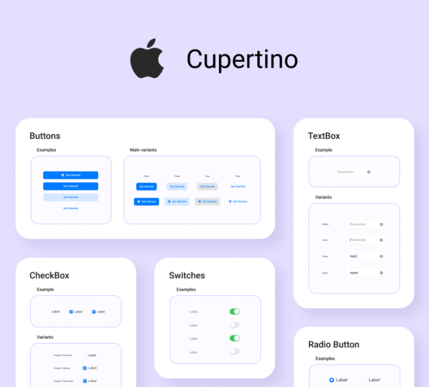

# Uno Cupertino

<p align="center">
  
</p>

Uno Cupertino is an add-on package that lets you apply [Cupertino - Human Interface Guideline styling](https://developer.apple.com/design/human-interface-guidelines) to your application with a few lines of code.

## Getting Started

### Creating a new project with Uno Cupertino

1. Install the [`dotnet new` CLI templates](xref:Uno.GetStarted.dotnet-new) with:

    ```bash
    dotnet new install Uno.Templates
    ```

2. Create a new application with:

    ```bash
    dotnet new unoapp -o UnoCupertinoApp -theme cupertino
    ```

### Installing Uno Cupertino in an existing project

Depending on the type of project template that the Uno Platform application was created with, follow the instructions below to install Uno Cupertino.

# [**Single Project Template**](#tab/singleproj)

1. Edit your project file (`PROJECT_NAME.csproj`) and add `Cupertino` to the list of `UnoFeatures`:

    ```xml
    <UnoFeatures>Cupertino</UnoFeatures>
    ```

2. Initialize the Cupertino resources in the `App.xaml`:

    ```xml
    <Application.Resources>
        <ResourceDictionary>
            <ResourceDictionary.MergedDictionaries>

                <!-- Code ommitted of brevity -->

                <uc:CupertinoColors xmlns="using:Uno.Cupertino" />
                <uc:CupertinoFonts xmlns="using:Uno.Cupertino" />
                <uc:CupertinoResources xmlns="using:Uno.Cupertino" />
            </ResourceDictionary.MergedDictionaries>
        </ResourceDictionary>
    </Application.Resources>
    ```

# [**Multi-Head Project Template**](#tab/multihead)

1. In the Solution Explorer panel, right-click on your app's **App Code Library** project (`PROJECT_NAME.csproj`) and select `Manage NuGet Packages...`
1. Install the [`Uno.Cupertino.WinUI`](https://www.nuget.org/packages/Uno.Cupertino.WinUI)
1. Add the following Cupertino resources to `AppResources.xaml`:

    ```xml
    <ResourceDictionary>
        <ResourceDictionary.MergedDictionaries>

        <CupertinoColors xmlns="using:Uno.Cupertino" />
        <CupertinoFonts xmlns="using:Uno.Cupertino" />
        <CupertinoResources xmlns="using:Uno.Cupertino" />

        </ResourceDictionary.MergedDictionaries>
    </ResourceDictionary>
    ```

# [**Shared Project (.shproj) Template**](#tab/shproj)

1. In the Solution Explorer panel, right-click on your solution name and select `Manage NuGet Packages for Solution ...`. Choose either:
    - The [`Uno.Cupertino`](https://www.nuget.org/packages/Uno.Cupertino/) package when targetting Xamarin/UWP
    - The [`Uno.Cupertino.WinUI`](https://www.nuget.org/packages/Uno.Cupertino.WinUI) package when targetting net6.0+/WinUI

2. Select the following projects for installation:
    - `PROJECT_NAME.Wasm.csproj`
    - `PROJECT_NAME.Mobile.csproj` (or `PROJECT_NAME.iOS.csproj`, `PROJECT_NAME.Droid.csproj`, and `PROJECT_NAME.macOS.csproj` if you have an existing project)
    - `PROJECT_NAME.Skia.Gtk.csproj`
    - `PROJECT_NAME.Skia.WPF.csproj`
    - `PROJECT_NAME.Windows.csproj` (or `PROJECT_NAME.UWP.csproj` for existing projects)
3. Add the following resources inside `App.xaml`:

    ```xml
    <Application>
        <Application.Resources>
            <ResourceDictionary>
                <ResourceDictionary.MergedDictionaries>

                    <!-- Load WinUI resources -->
                    <XamlControlsResources xmlns="using:Microsoft.UI.Xaml.Controls" />

                    <!-- Load Uno.Cupertino resources -->
                    <CupertinoColors xmlns="using:Uno.Cupertino" />
                    <CupertinoFonts xmlns="using:Uno.Cupertino" />
                    <CupertinoResources xmlns="using:Uno.Cupertino" />

                    <!-- Load custom application resources -->
                    <!-- ... -->

                </ResourceDictionary.MergedDictionaries>
            </ResourceDictionary>
        </Application.Resources>
    </Application>
    ```

---

## Customization

The following guides require the creation of new `ResourceDictionary` files in your application project. For more information on how to define styles and resources in a separate `ResourceDictionary`, refer to the [resource management documentation](xref:Guide.HowTo.Create-Control-Library#moving-the-control-style-in-a-separate-resource-dictionary).

### Customize Color Palette

1. Add a new Resource Dictionary named `CupertinoColorsOverride.xaml` to the application project, for example, under `Styles/Application`.
2. Replace the content with:

    ```xml
    <ResourceDictionary xmlns="http://schemas.microsoft.com/winfx/2006/xaml/presentation"
                        xmlns:x="http://schemas.microsoft.com/winfx/2006/xaml">
        <ResourceDictionary.ThemeDictionaries>

            <!-- Light Theme -->
            <ResourceDictionary x:Key="Light">
                <!-- Override CupertinoBlueBrush -->
                <Color x:Key="CupertinoBlueBrush">#6750A4</Color>

                <!-- Add more overrides here -->
                <!-- ... -->
            </ResourceDictionary>

            <!-- Dark Theme -->
            <ResourceDictionary x:Key="Dark">
                <!-- Override CupertinoBlueBrush -->
                <Color x:Key="CupertinoBlueBrush">#D0BCFF</Color>

                <!-- Add more overrides here -->
                <!-- ... -->
            </ResourceDictionary>

        </ResourceDictionary.ThemeDictionaries>
    </ResourceDictionary>
    ```

3. In `App.xaml`, update `<CupertinoColors />` with the override from the previous steps:

    ```xml
    <CupertinoColors xmlns="using:Uno.Cupertino"
                     OverrideSource="ms-appx:///Styles/Application/CupertinoColorsOverride.xaml" />
    ```

### Change Default Font

By default, Uno Cupertino comes pre-packaged with the [SF Pro](https://developer.apple.com/fonts/) `FontFamily` and automatically includes them in your application. Upon installation of the Uno Cupertino package, you will have a `CupertinoFontFamily` resource available.

If you would like Uno Cupertino to use a different font, you can override the default `FontFamily` by following these steps:

1. Add the custom font following [Custom Fonts documentation](https://platform.uno/docs/articles/features/custom-fonts.html).
2. Add a new Resource Dictionary named `CupertinoFontsOverride.xaml` to the application project, for example, under `Styles/Application`.
3. Assuming the font file has been placed in a directory such as `Assets/Fonts/MyCustomFont.ttf`, your override file would look like the following:

    ```xml
    <ResourceDictionary xmlns="http://schemas.microsoft.com/winfx/2006/xaml/presentation"
                        xmlns:x="http://schemas.microsoft.com/winfx/2006/xaml">

        <FontFamily x:Key="CupertinoFontFamily">ms-appx:///Assets/Fonts/MyCustomFont.ttf</FontFamily>

    </ResourceDictionary>
    ```

4. In the `App.xaml`, update `<CupertinoFonts />` with the override from the previous steps:

    ```xml
    <CupertinoFonts xmlns="using:Uno.Cupertino"
                    OverrideSource="ms-appx:///Styles/Application/CupertinoFontsOverride.xaml" />
    ```
