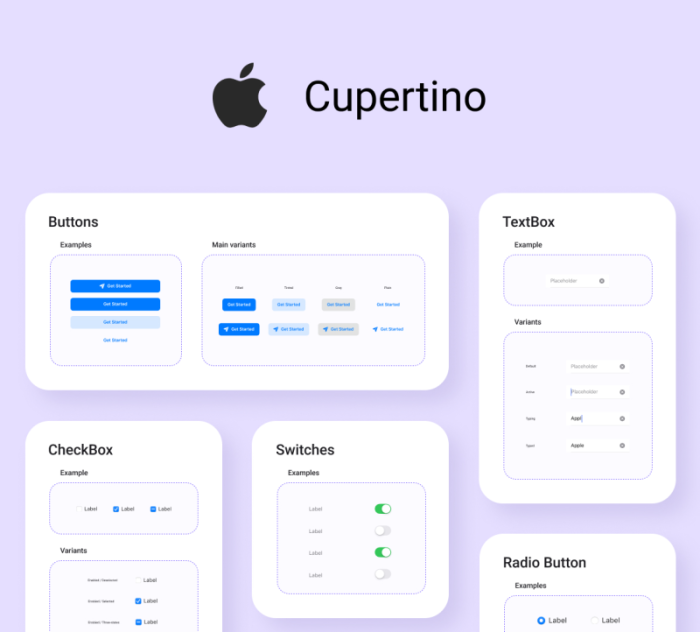

# Uno Cupertino

<p align="center">
  
</p>

> [!IMPORTANT]
> UnoFeatures: **Cupertino** — add `<UnoFeatures>Cupertino</UnoFeatures>` to your app's `.csproj` to enable Uno Cupertino.

Uno Cupertino is enabled through the `Cupertino` UnoFeatures and lets you apply [Cupertino - Human Interface Guideline styling](https://developer.apple.com/design/human-interface-guidelines) to your application with a few lines of code.

## Getting Started

> [!NOTE]
> Make sure to setup your environment first by [following our instructions](xref:Uno.GetStarted.vs2022).

### Creating a new project with Uno Cupertino

1. Install the [`dotnet new` CLI templates](xref:Uno.GetStarted.dotnet-new) with:

    ```bash
    dotnet new install Uno.Templates
    ```

2. Create a new application with:

    ```bash
    dotnet new unoapp -o UnoCupertinoApp -theme cupertino
    ```

### Installing Uno Cupertino in an existing project

Depending on the type of project template that the Uno Platform application was created with, follow the instructions below to install Uno Cupertino.

#### [**Single Project Template**](#tab/singleproj)

1. Edit your project file (`PROJECT_NAME.csproj`) and add `Cupertino` to the list of `UnoFeatures`:

    ```xml
    <UnoFeatures>Cupertino</UnoFeatures>
    ```

2. Initialize the Cupertino resources in the `App.xaml`:

    ```xml
    <Application.Resources>
        <ResourceDictionary>
            <ResourceDictionary.MergedDictionaries>

                <!-- Code ommitted of brevity -->

                <CupertinoTheme xmlns="using:Uno.Cupertino" />
            </ResourceDictionary.MergedDictionaries>
        </ResourceDictionary>
    </Application.Resources>
    ```

#### [**Multi-Head Project Template (Legacy)**](#tab/multihead)

> [!NOTE]
> Use this only when working on older multi-head templates that do not support `UnoFeatures`. Modern templates should use the Single Project instructions above.

1. In the Solution Explorer panel, right-click on your app's **App Code Library** project (`PROJECT_NAME.csproj`) and select `Manage NuGet Packages...`
1. Install the [`Uno.Cupertino.WinUI`](https://www.nuget.org/packages/Uno.Cupertino.WinUI)
1. Add the following Cupertino resources to `AppResources.xaml`:

    ```xml
    <ResourceDictionary>
        <ResourceDictionary.MergedDictionaries>

        <CupertinoTheme xmlns="using:Uno.Cupertino" />

        </ResourceDictionary.MergedDictionaries>
    </ResourceDictionary>
    ```

#### [**Shared Project (.shproj) Template (Legacy)**](#tab/shproj)

> [!NOTE]
> Use this only when working on older `.shproj`-based solutions that do not support `UnoFeatures`. Modern templates should use the Single Project instructions above.

1. In the Solution Explorer panel, right-click on your solution name and select `Manage NuGet Packages for Solution ...`. Choose either:
    - The [`Uno.Cupertino`](https://www.nuget.org/packages/Uno.Cupertino/) package when targetting Xamarin/UWP
    - The [`Uno.Cupertino.WinUI`](https://www.nuget.org/packages/Uno.Cupertino.WinUI) package when targetting net6.0+/WinUI

2. Select the following projects for installation:
    - `PROJECT_NAME.Wasm.csproj`
    - `PROJECT_NAME.Mobile.csproj` (or `PROJECT_NAME.iOS.csproj`, `PROJECT_NAME.Droid.csproj`, and `PROJECT_NAME.macOS.csproj` if you have an existing project)
    - `PROJECT_NAME.Skia.Gtk.csproj`
    - `PROJECT_NAME.Skia.WPF.csproj`
    - `PROJECT_NAME.Windows.csproj` (or `PROJECT_NAME.UWP.csproj` for existing projects)
3. Add the following resources inside `App.xaml`:

    ```xml
    <Application>
        <Application.Resources>
            <ResourceDictionary>
                <ResourceDictionary.MergedDictionaries>

                    <!-- Load WinUI resources -->
                    <XamlControlsResources xmlns="using:Microsoft.UI.Xaml.Controls" />

                    <!-- Load Uno.Cupertino resources -->
                    <CupertinoTheme xmlns="using:Uno.Cupertino" />

                    <!-- Load custom application resources -->
                    <!-- ... -->

                </ResourceDictionary.MergedDictionaries>
            </ResourceDictionary>
        </Application.Resources>
    </Application>
    ```

---

## Using `CupertinoTheme`

`CupertinoTheme` puts Cupertino on the same semantic system as `MaterialTheme` and `SimpleTheme`: a single dictionary that brings the styles, maps Apple's system palette onto the [shared color roles](xref:Uno.Themes.SemanticStyles) (`PrimaryBrush`, `SurfaceBrush`, `OutlineBrush`, …), maps the iOS text styles onto the shared type scale (`BodyLargeFontSize`, `TitleMediumFontWeight`, …), and generates the [design tokens](xref:Uno.Themes.DesignTokens) (`Space*`, `Radius*`, `ControlHeight*`).

```xml
<Application.Resources>
    <ResourceDictionary>
        <ResourceDictionary.MergedDictionaries>
            <XamlControlsResources xmlns="using:Microsoft.UI.Xaml.Controls" />

            <CupertinoTheme xmlns="using:Uno.Cupertino" />
        </ResourceDictionary.MergedDictionaries>
    </ResourceDictionary>
</Application.Resources>
```

It accepts the same properties as the other themes — `FontOverrideSource`, `DefaultFontFamily`, `DefaultSpacing`, `DefaultDensity`, `DefaultCornerRadius` and `Colors`:

```xml
<CupertinoTheme xmlns="using:Uno.Cupertino"
                xmlns:ut="using:Uno.Themes"
                DefaultCornerRadius="6">
    <CupertinoTheme.Colors>
        <ut:ThemeColors PrimarySeed="#2E7D32" />
    </CupertinoTheme.Colors>
</CupertinoTheme>
```

The semantic style keys Cupertino has a style for are aliased (`FilledButtonStyle`, `TextButtonStyle`, `OutlinedTextBoxStyle`, `OutlinedPasswordBoxStyle`, `ComboBoxStyle`, `ComboBoxItemStyle`, `CheckBoxStyle`, `RadioButtonStyle`, `ToggleSwitchStyle`, `SliderStyle`, `HyperlinkButtonStyle`, `CalendarViewStyle`, `CalendarDatePickerStyle`, `DatePickerStyle`, `ProgressBarStyle`, `ProgressRingStyle`), and so are the 19 text styles of the shared type scale (`DisplayLarge` … `CaptionSmall`), so markup written against those keys moves between design systems unchanged. The Apple-named text styles (`CupertinoLargeTitle`, `CupertinoHeadline`, `CupertinoBody`, …) are the matching slot plus its leading, so they follow the same `*FontSize` / `*FontWeight` tokens.

> [!NOTE]
> With a [seed color](xref:Uno.Themes.SeedColors), the container roles follow the Material 3 recipe rather than Apple's tinted fills: the generated scheme is coherent, but it is no longer the stock Apple palette. The accent brushes of the Cupertino vocabulary — `CupertinoBlueBrush` and `CupertinoLinkBrush` — follow the seeded primary, so the built-in `Cupertino*Style` control styles pick the accent up too; the other system colors (`CupertinoRedBrush`, `CupertinoGreenBrush`, …) keep their Apple values.

### Cupertino colors and brushes

Alongside the shared roles, `CupertinoTheme` keeps the Cupertino vocabulary: the system colors (`CupertinoRedColor`, `CupertinoOrangeColor`, `CupertinoYellowColor`, `CupertinoGreenColor`, `CupertinoMintColor`, `CupertinoTealColor`, `CupertinoCyanColor`, `CupertinoBlueColor`, `CupertinoIndigoColor`, `CupertinoPurpleColor`, `CupertinoPinkColor`, `CupertinoBrownColor`), the six grays, and the label, fill, background and separator colors, each with a matching `Cupertino*Brush`. The values follow Apple's system palette as published in June 2025.

The brushes are live: overriding a `*Color` key through `Colors.OverrideSource` repaints everything already on screen that uses the matching brush, without re-navigation. To re-tint the accent, override `PrimaryColor` (it reaches the semantic brushes and the Cupertino accent brushes) or `CupertinoBlueColor` (the Cupertino accent only; it wins over `PrimaryColor` and over a seed).

## Migrating from `CupertinoColors` / `CupertinoFonts` / `CupertinoResources`

The three dictionaries were removed in this major version; an app that declares them no longer compiles. Replace the three with one `CupertinoTheme`:

```xml
<!-- Before -->
<CupertinoColors xmlns="using:Uno.Cupertino"
                 OverrideSource="ms-appx:///Styles/Application/CupertinoColorsOverride.xaml" />
<CupertinoFonts xmlns="using:Uno.Cupertino"
                OverrideSource="ms-appx:///Styles/Application/CupertinoFontsOverride.xaml" />
<CupertinoResources xmlns="using:Uno.Cupertino" />

<!-- After -->
<CupertinoTheme xmlns="using:Uno.Cupertino"
                xmlns:ut="using:Uno.Themes"
                FontOverrideSource="ms-appx:///Styles/Application/CupertinoFontsOverride.xaml">
    <CupertinoTheme.Colors>
        <ut:ThemeColors OverrideSource="ms-appx:///Styles/Application/CupertinoColorsOverride.xaml" />
    </CupertinoTheme.Colors>
</CupertinoTheme>
```

What else changes when you upgrade:

- **Implicit styles are always on.** `WithImplicitStyles` is gone, and unstyled `Button`, `TextBox`, `CheckBox`, `ToggleSwitch`, `Slider`, `TextBlock`, … now pick up the Cupertino styles. Set an explicit `Style` where you relied on the platform default.
- **A dictionary that merged `<CupertinoColors />` or `<CupertinoFonts />`** to resolve `{StaticResource Cupertino*Brush}` should drop the merge: the keys now come from the `CupertinoTheme` in `App.xaml`.
- **An unstyled `TextBlock` gets the Cupertino typeface, wrapping and trimming, not a size.** Apply `BodyLarge` (or `CupertinoBody`) where you want the 17 pt body style.
- **Color values** moved to Apple's June 2025 system palette (for example `CupertinoBlueColor` is `#0088FF` / `#0091FF`, previously `#007BFF` / `#0A84FF`).
- **The default typeface is Inter**, see [Change Default Font](#change-default-font).
- **In a font override file, redefine `DefaultFontFamily`.** `CupertinoFontFamily` is an alias of that root, so a file that only redefines `CupertinoFontFamily` no longer changes the typeface.

## Customization

The following guides require the creation of new `ResourceDictionary` files in your application project. For more information on how to define styles and resources in a separate `ResourceDictionary`, refer to the [resource management documentation](xref:Guide.HowTo.Create-Control-Library#moving-the-control-style-in-a-separate-resource-dictionary).

### Customize Color Palette

1. Add a new Resource Dictionary named `CupertinoColorsOverride.xaml` to the application project, for example, under `Styles/Application`.
2. Replace the content with:

    ```xml
    <ResourceDictionary xmlns="http://schemas.microsoft.com/winfx/2006/xaml/presentation"
                        xmlns:x="http://schemas.microsoft.com/winfx/2006/xaml">
        <ResourceDictionary.ThemeDictionaries>

            <!-- Light Theme -->
            <ResourceDictionary x:Key="Light">
                <!-- Override CupertinoBlueColor -->
                <Color x:Key="CupertinoBlueColor">#6750A4</Color>

                <!-- Add more overrides here -->
                <!-- ... -->
            </ResourceDictionary>

            <!-- Dark Theme -->
            <ResourceDictionary x:Key="Dark">
                <!-- Override CupertinoBlueColor -->
                <Color x:Key="CupertinoBlueColor">#D0BCFF</Color>

                <!-- Add more overrides here -->
                <!-- ... -->
            </ResourceDictionary>

        </ResourceDictionary.ThemeDictionaries>
    </ResourceDictionary>
    ```

3. In `App.xaml`, update `<CupertinoTheme />` with the override from the previous steps:

    ```xml
    <CupertinoTheme xmlns="using:Uno.Cupertino"
                    xmlns:ut="using:Uno.Themes">
        <CupertinoTheme.Colors>
            <ut:ThemeColors OverrideSource="ms-appx:///Styles/Application/CupertinoColorsOverride.xaml" />
        </CupertinoTheme.Colors>
    </CupertinoTheme>
    ```

The same file can override the shared roles (`PrimaryColor`, `SurfaceColor`, …). To derive the whole scheme from one color instead, see [Seed Color Palette](xref:Uno.Themes.SeedColors).

### Change Default Font

By default, Uno Cupertino uses [Inter](https://rsms.me/inter/), brought in through the `Uno.Fonts.Inter` package, so text renders the same on every platform. Apple's SF Pro cannot be redistributed and does not resolve by name outside Apple devices, which is why it is not the default. The root of the type scale is the shared `DefaultFontFamily` token (see [Design Tokens](design-tokens.md#typography)); `CupertinoFontFamily`, which the Cupertino control styles read, is an alias of it. Overriding only the alias changes those control styles but not the shared type scale (`BodyLargeFontFamily`, …), so override the root and both follow.

If you would like Uno Cupertino to use a different font, you can override the default `FontFamily` by following these steps:

1. Add the custom font following [Custom Fonts documentation](https://platform.uno/docs/articles/features/custom-fonts.html).
2. Add a new Resource Dictionary named `CupertinoFontsOverride.xaml` to the application project, for example, under `Styles/Application`.
3. Assuming the font file has been placed in a directory such as `Assets/Fonts/MyCustomFont.ttf`, your override file would look like the following:

    ```xml
    <ResourceDictionary xmlns="http://schemas.microsoft.com/winfx/2006/xaml/presentation"
                        xmlns:x="http://schemas.microsoft.com/winfx/2006/xaml">

        <FontFamily x:Key="DefaultFontFamily">ms-appx:///Assets/Fonts/MyCustomFont.ttf</FontFamily>

    </ResourceDictionary>
    ```

4. In the `App.xaml`, update `<CupertinoTheme />` with the override from the previous steps:

    ```xml
    <CupertinoTheme xmlns="using:Uno.Cupertino"
                    FontOverrideSource="ms-appx:///Styles/Application/CupertinoFontsOverride.xaml" />
    ```

For a font that needs no file of its own, the `DefaultFontFamily` property does the same in one line, and can be changed at runtime — see [Typography Font Swap](design-tokens.md#typography-font-swap).

> [!TIP]
> To use the system font on macOS, set `DefaultFontFamily=".AppleSystemUIFont"` on the theme. Family names such as `SF Pro`, `SF Pro Text` or `system-ui` do not resolve through Skia, even on a Mac: they fall back silently to the platform default, which is why they are not used here.
