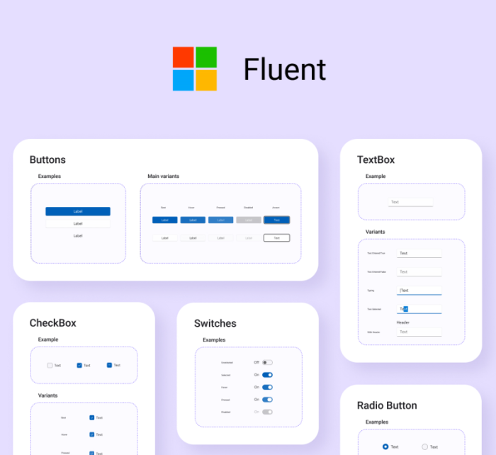

# Fluent-styled controls

<p align="center">
  
</p>

Uno Platform 3.0 and above supports control styles conforming to the [Fluent design system](https://www.microsoft.com/design/fluent).
The details below explain how to use them in your app.

## Upgrading existing Uno apps to use Fluent styles

Overall, the Uno Platform uses the same mechanism as WinUI to enable Fluent styles. After installing the `Uno.UI` NuGet version 3.0 or above, Fluent styles are enabled by specifying the `XamlControlsResources` within the application's resources (inside `App.xaml`).

For the UWP head, an additional WinUI 2 NuGet package reference must be added. This is following the same process as UWP because, for the UWP head, the Uno Platform is not used.

The step-by-step process to enable Fluent design styles within an existing Uno Platform solution is as follows:

1. In all platform head projects except UWP update the `Uno.UI` NuGet packages to 3.0 or above.

1. In only the `UWP` head project of your solution, if you have one, install the [WinUI 2 NuGet package](https://www.nuget.org/packages/Microsoft.UI.Xaml). This step is the same as required for WinUI 2 UWP apps.

1. Within the shared project used by all platform heads, add the `XamlControlsResources` resource dictionary to your application resources inside `App.xaml`. This step is the same as required for WinUI 2 UWP apps.

    ```xml
        <Application>
            <Application.Resources>
                <!-- Load WinUI resources -->
                <XamlControlsResources xmlns="using:Microsoft.UI.Xaml.Controls" />
            </Application.Resources>
        </Application>
    ```

    Or, if you have other existing application-scope resources, add `XamlControlsResources` at the top (before other resources) as a merged dictionary:

    ```xml
        <Application.Resources>
            <ResourceDictionary>
                <ResourceDictionary.MergedDictionaries>
                    <!-- Load WinUI resources -->
                    <XamlControlsResources xmlns="using:Microsoft.UI.Xaml.Controls" />
                    <!-- Other merged dictionaries here -->
                </ResourceDictionary.MergedDictionaries>
                <!-- Other app resources here -->
            </ResourceDictionary>
        </Application.Resources>
    ```

1. In all platform head projects except UWP, the Fluent control styles require the Uno Fluent Assets icon font to display correctly. Follow [Uno Fluent UI assets documentation](https://platform.uno/docs/articles/uno-fluent-assets.html) to upgrade your app to use this font. This step is required because the Uno Platform uses a cross-platform ready default font within its styles different from UWP's *Segoe MDL2 Assets*.
