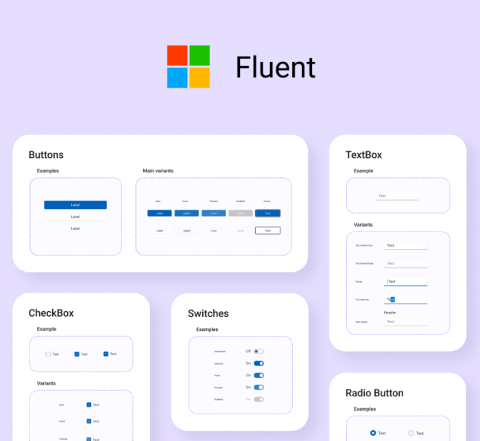

# Fluent-styled controls

<p align="center">
  
</p>

Uno Platform 3.0 and above supports control styles conforming to the [Fluent design system](https://www.microsoft.com/design/fluent).
The details below explain how to use them in your app.

## Upgrading existing Uno apps to use Fluent styles

Overall, the Uno Platform uses the same mechanism as WinUI to enable Fluent styles. After installing the `Uno.UI` NuGet version 3.0 or above, Fluent styles are enabled by specifying the `XamlControlsResources` within the application's resources (inside `App.xaml`).

For the UWP head, an additional WinUI 2 NuGet package reference must be added. This is following the same process as UWP because, for the UWP head, the Uno Platform is not used.

The step-by-step process to enable Fluent design styles within an existing Uno Platform solution is as follows:

1. In all platform head projects except UWP update the `Uno.UI` NuGet packages to 3.0 or above.

1. In only the `UWP` head project of your solution, if you have one, install the [WinUI 2 NuGet package](https://www.nuget.org/packages/Microsoft.UI.Xaml). This step is the same as required for WinUI 2 UWP apps.

1. Add the `XamlControlsResources` resource dictionary to your application resources inside `App.xaml`. This step is the same as required for WinUI 2 UWP apps.

    ```xml
    <Application>
        <Application.Resources>
            <!-- Load WinUI resources -->
            <XamlControlsResources xmlns="using:Microsoft.UI.Xaml.Controls" />
        </Application.Resources>
    </Application>
    ```

    Or, if you have other existing application-scope resources, add `XamlControlsResources` at the top (before other resources) as a merged dictionary:

    ```xml
    <Application.Resources>
        <ResourceDictionary>
            <ResourceDictionary.MergedDictionaries>
                <!-- Load WinUI resources -->
                <XamlControlsResources xmlns="using:Microsoft.UI.Xaml.Controls" />
                <!-- Other merged dictionaries here -->
            </ResourceDictionary.MergedDictionaries>
            <!-- Other app resources here -->
        </ResourceDictionary>
    </Application.Resources>
    ```

## FluentTheme: the Uno Themes semantic layer with a Fluent look

`XamlControlsResources` alone gives you the Fluent control styles under their WinUI names (`AccentButtonStyle`, `BodyTextBlockStyle`, …). If your app is written against the Uno Themes **semantic abstraction layer** — [semantic style keys](semantic-styles.md) like `FilledButtonStyle`, the semantic color palette (`PrimaryBrush`, `OnSurfaceBrush`, …), the semantic typography slots (`DisplayLarge` … `CaptionSmall`), and the [design tokens](design-tokens.md) — the `Uno.Fluent.WinUI` package maps that whole layer onto the built-in Fluent styles, so the same XAML that renders Material under `MaterialTheme` renders the platform-default Fluent look instead.

`FluentTheme` is an *adapter*, not a style library: it ships **no control templates and no implicit styles**. Fluent is already the implicit default of every WinUI / Uno Platform app; the theme only adds:

- **Semantic style aliases** onto the built-in Fluent styles (`FilledButtonStyle` &rarr; `AccentButtonStyle`, `OutlinedTextBoxStyle` &rarr; `DefaultTextBoxStyle`, …) — see the Fluent column in [Semantic Styles](semantic-styles.md).
- **Fluent color values** for the semantic color roles: the accent roles track the system accent (`SystemAccentColor` and its shades — on Windows, the user's real accent color), and the neutral/surface/error roles carry the corresponding Fluent design-token values, per Light/Dark theme.
- **Fluent typography values** for the 19 semantic type slots, using the [Fluent type ramp](https://learn.microsoft.com/en-us/windows/apps/design/style/typography) sizes/weights and the platform-default font (`ContentControlThemeFontFamily`) — no font package is shipped.
- The shared `BaseTheme` machinery: `Space*`/`Radius*` design tokens, `DefaultDensity`, `DefaultCornerRadius`, [seed colors](seed-colors.md) (opt-in), color overrides, and hot reload.

### Installation

Add a reference to the `Uno.Fluent.WinUI` NuGet package to your application project.

### App.xaml setup

Merge `FluentTheme` **after** `XamlControlsResources`:

```xml
<Application.Resources>
    <ResourceDictionary>
        <ResourceDictionary.MergedDictionaries>
            <!-- Load WinUI resources — MUST come first -->
            <XamlControlsResources xmlns="using:Microsoft.UI.Xaml.Controls" />

            <!-- Load the Uno Themes semantic layer mapped onto Fluent -->
            <FluentTheme xmlns="using:Uno.Fluent" />

            <!-- Other merged dictionaries here -->
        </ResourceDictionary.MergedDictionaries>
    </ResourceDictionary>
</Application.Resources>
```

> [!IMPORTANT]
> The ordering requirement is load-bearing: `FluentTheme`'s semantic aliases and color mappings resolve against the resources `XamlControlsResources` provides. When the Fluent tokens are unreachable (for example, the dictionaries are merged in the wrong order), the semantic colors keep the Uno Themes shared defaults and a warning is logged — theme initialization never throws.

### Behavior notes

- **Interaction states**: the semantic layer encodes interaction states as opacity variants of the rest color (`PrimaryHoverBrush` = `PrimaryColor` at hover opacity), while Fluent uses discrete per-state fill colors inside its templates. Under `FluentTheme`, built-in controls keep Fluent's own state behavior (correct by definition); app XAML that uses semantic *state* brushes gets opacity-derived variants of the Fluent rest colors — visually consistent, but not token-identical to Fluent's hover/pressed colors.
- **Materials**: Mica and Acrylic are not applied by the theme. The semantic surface roles map to Fluent's solid-color fallback tokens (`SolidBackgroundFillColor*`); apps can layer materials themselves where supported.
- **Seed colors**: like all Uno Themes, setting `Colors.PrimarySeed` generates a semantic palette from your brand color ([seed colors](seed-colors.md)). `FluentTheme` uses high-fidelity generation (the seed's chroma is preserved rather than re-saturated). Without a seed, the palette follows the platform accent and Fluent neutrals.
- **Lightweight styling**: the semantic [lightweight-styling](lightweight-styling.md) keys are bridged to the built-in Fluent control resources for Button, TextBox, CheckBox, RadioButton, ToggleSwitch, and Slider. For CheckBox/RadioButton/Slider most key names are WinUI's own, so overrides work natively at any scope; for divergent names, app-wide overrides go through `Colors.OverrideDictionary` and page-scoped overrides target the Fluent per-control keys directly. See [Lightweight Styling — Fluent theme](lightweight-styling.md#fluent-theme).
