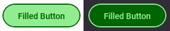
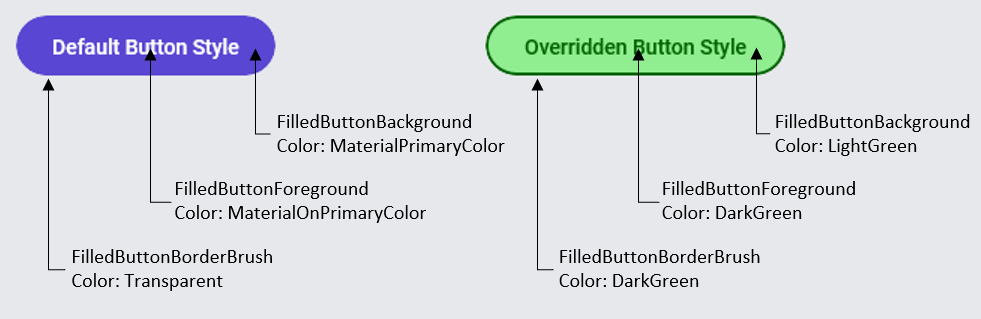
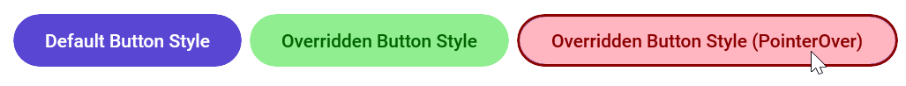

# Lightweight Styling

[Lightweight styling](https://learn.microsoft.com/windows/apps/design/style/xaml-styles#lightweight-styling) is a way to customize the appearance of XAML controls by **overriding** their default brushes, fonts, and numeric properties. Lightweight styles are changed by providing alternate resources with the same key. All Uno Material styles support the capability to be customized through resource overrides without the need to redefine the style.

Overriding resources from Uno Material can be done at the App level, Page level, or even at the Control level. The following sections will cover how to override resources at each of these levels.

## App/Page level styling

The most common way to override resources is at the App level. This is done by adding a new `ResourceDictionary` to the `ResourceDictionary.MergedDictionaries` collection in your `AppResources.xaml` file. The following XAML shows how to override the default resources used with the `FilledButtonStyle` from Uno Themes.

```xml
<!-- AppResources.xaml -->
<ResourceDictionary.MergedDictionaries>

    <!-- Load WinUI resources -->
    <XamlControlsResources xmlns="using:Microsoft.UI.Xaml.Controls" />

    <!-- Load Uno Material resources -->
    <MaterialTheme xmlns="using:Uno.Material" />

    <!-- Override resources -->
    <ResourceDictionary>
        <ResourceDictionary.ThemeDictionaries>
            <ResourceDictionary x:Key="Light">
                <Thickness x:Key="ButtonBorderThickness">2</Thickness>
                <SolidColorBrush x:Key="FilledButtonForeground" Color="DarkGreen" />
                <SolidColorBrush x:Key="FilledButtonBackground" Color="LightGreen" />
                <SolidColorBrush x:Key="FilledButtonBorderBrush" Color="DarkGreen" />
            </ResourceDictionary>
            <ResourceDictionary x:Key="Default">
                <Thickness x:Key="ButtonBorderThickness">2</Thickness>
                <SolidColorBrush x:Key="FilledButtonForeground" Color="LightGreen" />
                <SolidColorBrush x:Key="FilledButtonBackground" Color="DarkGreen" />
                <SolidColorBrush x:Key="FilledButtonBorderBrush" Color="LightGreen" />
            </ResourceDictionary>
        </ResourceDictionary.ThemeDictionaries>
    </ResourceDictionary>

</ResourceDictionary.MergedDictionaries>
```

Notice the `ResourceDictionary.ThemeDictionaries` element. This is where you can override resources for each theme. In the example above, we are overriding the resources for both the Light and Default themes. The Light theme is used when the device is in Light mode, and the Default theme is used when the device is in Dark mode. Below is an example of the same `Button` using the `FilledButtonStyle` from Uno Material, but with the overrides from above applied to both the Light and Dark themes.



Placing these brush overrides at the `AppResources.xaml` level will alter every `Button` that is styled with `FilledButtonStyle` within the entire application. The overrides can be scoped to a specific page by placing them in the `Page.Resources` element of the page’s XAML. The following XAML shows how to override the same resources from above, but scoped to a specific page.

```xml
<!-- MyPage.xaml -->
<Page.Resources>
    <ResourceDictionary xmlns="http://schemas.microsoft.com/winfx/2006/xaml/presentation"
                        xmlns:x="http://schemas.microsoft.com/winfx/2006/xaml">
        <ResourceDictionary.ThemeDictionaries>
            <ResourceDictionary x:Key="Light">
                <Thickness x:Key="ButtonBorderThickness">2</Thickness>
                <SolidColorBrush x:Key="FilledButtonForeground" Color="DarkGreen" />
                <SolidColorBrush x:Key="FilledButtonBackground" Color="LightGreen" />
                <SolidColorBrush x:Key="FilledButtonBorderBrush" Color="DarkGreen" />
            </ResourceDictionary>
            <ResourceDictionary x:Key="Default">
                <Thickness x:Key="ButtonBorderThickness">2</Thickness>
                <SolidColorBrush x:Key="FilledButtonForeground" Color="LightGreen" />
                <SolidColorBrush x:Key="FilledButtonBackground" Color="DarkGreen" />
                <SolidColorBrush x:Key="FilledButtonBorderBrush" Color="LightGreen" />
            </ResourceDictionary>
        </ResourceDictionary.ThemeDictionaries>
    </ResourceDictionary>
</Page.Resources>
```

## Per-control styling

In other cases, changing a single control on one page only to look a certain way, without altering any other versions of that control, can also be achieved. The provided XAML code and image depict a `Button` using the default `FilledButtonStyle` followed by a second `Button`, also with `FilledButtonStyle` applied, but now with specific resource keys overridden to customize its appearance.

```xml
<Button Content="Default Button Style" 
        Style="{StaticResource FilledButtonStyle}" />

<Button Content="Overridden Button Style" 
        Style="{StaticResource FilledButtonStyle}"
        BorderThickness="2">
    <Button.Resources>
        <SolidColorBrush x:Key="FilledButtonForeground" Color="DarkGreen" />
        <SolidColorBrush x:Key="FilledButtonBackground" Color="LightGreen" />
        <SolidColorBrush x:Key="FilledButtonBorderBrush" Color="DarkGreen" />
    </Button.Resources>
</Button>
```



Lightweight Styling allows for fine-grained control over the look of your UI components across all visual states. All interactive controls have multiple states, such as **PointerOver** (mouse is hovered over), **Pressed** (control is pressed on), and **Disabled** (control is not interactable). These states are appended onto the endings of the resource keys: ButtonForeground*PointerOver*, ButtonForeground*Pressed*, and ButtonForeground*Disabled*. Combined with these, the CheckBox and RadioButton controls also have **Checked** and **Unchecked** states. This means that it is possible to customize the appearance of your Uno Material-styled controls across any visual state without the need to redefine the style. As an example, the XAML below defines three Buttons, all using FilledButtonStyle from Uno Material:

1. A Default Button with no changes
2. A Button with several brush resources overridden for the **Normal** visual state
3. A Button that overrides resources that are used with FilledButtonStyle’s **PointerOver** visual state

```xml
<!-- #1 -->
<Button Content="Default Button Style"
        Style="{StaticResource FilledButtonStyle}" />

<!-- #2 -->
<Button Content="Overridden Button Style"
        Style="{StaticResource FilledButtonStyle}">
    <Button.Resources>
        <Thickness x:Key="ButtonBorderThickness">2</Thickness>
        <SolidColorBrush x:Key="FilledButtonForeground" Color="DarkGreen" />
        <SolidColorBrush x:Key="FilledButtonBackground" Color="LightGreen" />
        <SolidColorBrush x:Key="FilledButtonBorderBrush" Color="DarkGreen" />
    </Button.Resources>
</Button>

<!-- #3 -->
<Button Content="Overridden Button Style (PointerOver)"
        Style="{StaticResource FilledButtonStyle}">
    <Button.Resources>
        <Thickness x:Key="ButtonBorderThickness">2</Thickness>
        <SolidColorBrush x:Key="FilledButtonForegroundPointerOver" Color="DarkRed" />
        <SolidColorBrush x:Key="FilledButtonBackgroundPointerOver" Color="LightPink" />
        <SolidColorBrush x:Key="FilledButtonBorderBrushPointerOver" Color="DarkRed" />
    </Button.Resources>
</Button>
```

With this XAML we are given the following visual result, notice the third Button has a new BorderThickness applied and takes on different colors while in the **PointerOver** state.



## C# Markup

All Lightweight Styling resource key can also be used in C# Markup through a collection of static helper classes available in the [Uno.Themes.WinUI.Markup](https://www.nuget.org/packages/Uno.Themes.WinUI.Markup/) NuGet package. The following code shows how to override several `FilledButton` resources in C# from the previous XAML example above. Notice that the `Button` is still using the `FilledButtonStyle` from Uno Material, but the resources are being overridden.

```csharp
// #1
new Button()
    .Style(Theme.Button.Styles.Filled)
    .Content("Default Button Style"),

//#2
new Button()
    .Style(Theme.Button.Styles.Filled)
    .Resources(config => config
        .Add(Theme.Button.Resources.BorderThickness, 2)
        .Add(Theme.Button.Resources.Filled.Foreground.Default, new SolidColorBrush(Colors.DarkGreen))
        .Add(Theme.Button.Resources.Filled.Background.Default, new SolidColorBrush(Colors.LightGreen))
        .Add(Theme.Button.Resources.Filled.BorderBrush.Default, new SolidColorBrush(Colors.DarkGreen))
    )
    .Content("Overridden Button Style"),

//#3
new Button()
    .Style(Theme.Button.Styles.Filled)
    .Resources(config => config
        .Add(Theme.Button.Resources.BorderThickness, 2)
        .Add(Theme.Button.Resources.Filled.Foreground.PointerOver, new SolidColorBrush(Colors.DarkRed))
        .Add(Theme.Button.Resources.Filled.Background.PointerOver, new SolidColorBrush(Colors.LightPink))
        .Add(Theme.Button.Resources.Filled.BorderBrush.PointerOver, new SolidColorBrush(Colors.DarkRed))
    )
    .Content("Overridden Button Style (PointerOver)")
```

### Resource Key Pattern

The general pattern used for mapping the Lightweight Styling resource keys to C# Markup is as follows:

`Theme.{control}.Resources.{?:variant}.{member}.{?:visual-state}`

| Name Part | Description |
| --- | --- |
| `control` | Name of the control type (Button, TextBox, CheckBox, etc.) |
| `variant` | **(Optional) Defaults to `Default`** Certain styles have multiple variants. Ex: For Button we have variants such as: Outlined, Text, Filled | 
| `member` | The property that this style should be assigned to (Foreground, Background, BorderBrush, etc.) |
| `visual-state` | **(Optional) Defaults to `Default`**  Specifies which `VisualState` that this resource will be applied to (PointerOver, Checked, Disabled, etc.)  |

For example, the following resource keys are used with `FilledButtonStyle`, `HyperlinkButtonStyle`, and `CheckBoxStyle` from Uno Material:

##### Filled Button

`Theme.Button.Resources.Filled.Foreground.Default`
`Theme.Button.Resources.Filled.Foreground.Pressed`
`Theme.Button.Resources.Filled.Foreground.PointerOver`

##### HyperlinkButton (Default)

`Theme.HyperlinkButton.Resources.Default.Foreground.Default`
`Theme.HyperlinkButton.Resources.Default.Foreground.Pressed`
`Theme.HyperlinkButton.Resources.Default.Foreground.PointerOver`

##### CheckBox (Default)

`Theme.CheckBox.Resources.Default.Foreground.Checked`
`Theme.CheckBox.Resources.Default.Foreground.CheckedPressed`
`Theme.CheckBox.Resources.Default.Foreground.CheckedPointerOver`

All C# Markup-friendly Lightweight Styling resource keys can be found [here](https://github.com/unoplatform/Uno.Themes/tree/master/src/library/Uno.Themes.WinUI.Markup/Theme)

## Resource Keys

For more information about the lightweight styling resource keys used in each control, check out the following links:

- [Button](styles/Button.md)
- [CalendarDatePicker](styles/CalendarDatePicker.md)
- [CheckBox](styles/CheckBox.md)
- [ComboBox](styles/ComboBox.md)
- [DatePicker](styles/DatePicker.md)
- [FloatingActionButton](styles/FloatingActionButton.md)
- [HyperlinkButton](styles/HyperlinkButton.md)
- [NavigationView](styles/NavigationView.md)
- [PasswordBox](styles/PasswordBox.md)
- [PipsPager](styles/PipsPager.md)
- [ProgressBar](styles/ProgressBar.md)
- [ProgressRing](styles/ProgressRing.md)
- [RadioButton](styles/RadioButton.md)
- [RatingControl](styles/RatingControl.md)
- [Slider](styles/Slider.md)
- [TextBlock](styles/Typography.md)
- [TextBox](styles/TextBox.md)
- [ToggleButton](styles/ToggleButton.md)
- [ToggleSwitch](styles/ToggleSwitch.md)

## Toolkit

Toolkit also has controls that allow lightweight styling, check out [Lightweight Styling in Uno.Toolkit](xref:Toolkit.LightweightStyling).

### Further Reading

[Lightweight Styling (Windows Dev Docs)](https://learn.microsoft.com/windows/apps/design/style/xaml-styles#lightweight-styling)
