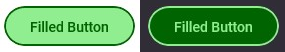
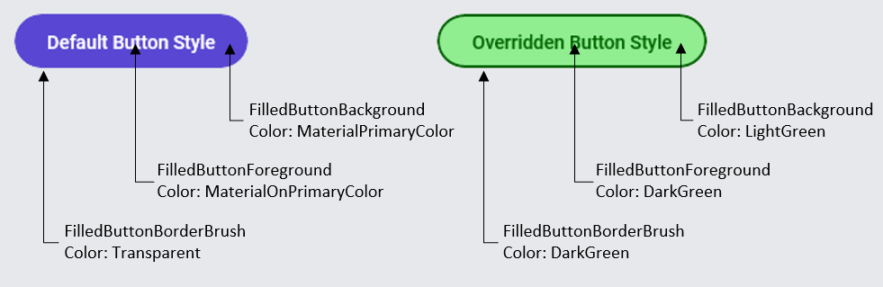
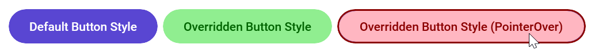

# Lightweight Styling

> [!IMPORTANT]
> UnoFeatures: **Material** — add `<UnoFeatures>Material</UnoFeatures>` to your app's `.csproj` to include the Uno Material resources used in these examples.

[Lightweight styling](https://learn.microsoft.com/windows/apps/design/style/xaml-styles#lightweight-styling) is a way to customize the appearance of XAML controls by **overriding** their default brushes, fonts, and numeric properties. Lightweight styles are changed by providing alternate resources with the same key. All Uno Material styles support the capability to be customized through resource overrides without the need to redefine the style.

Overriding resources from Uno Material can be done at the App level, Page level, or even at the Control level. The following sections will cover how to override resources at each of these levels.

Lightweight styling is surgical — one key at a time. To change the app's whole color theme at once, generate it from a single [seed color](seed-colors.md) instead; a lightweight override you define always wins over seed-generated values, so the two combine cleanly.

The examples below use Material v2. All three themes expose the semantic style names, with design-system-specific mappings and resource scopes. Check [semantic override compatibility](semantic-styles.md#override-compatibility), the [Simple control reference](simple-controls-styles.md), and the [Fluent section](#fluent-theme) when sharing overrides across themes. For a color-role change that should regenerate brushes, put the `*Color` override in the theme's `Colors.OverrideDictionary`; a page-local color resource alone does not rebuild the theme's brushes.

> [!Video https://www.youtube-nocookie.com/embed/5CsJHMTlNAw]

## App/Page level styling

The most common way to override resources is at the App level. This is done by adding a new `ResourceDictionary` to the `ResourceDictionary.MergedDictionaries` collection in your `AppResources.xaml` file. The following XAML shows how to override the default resources used with the `FilledButtonStyle` from Uno Themes.

```xml
<!-- AppResources.xaml -->
<ResourceDictionary.MergedDictionaries>

    <!-- Load WinUI resources -->
    <XamlControlsResources xmlns="using:Microsoft.UI.Xaml.Controls" />

    <!-- Load Uno Material resources -->
    <MaterialTheme xmlns="using:Uno.Material" />

    <!-- Override resources -->
    <ResourceDictionary>
        <ResourceDictionary.ThemeDictionaries>
            <ResourceDictionary x:Key="Light">
                <Thickness x:Key="ButtonBorderThickness">2</Thickness>
                <SolidColorBrush x:Key="FilledButtonForeground" Color="DarkGreen" />
                <SolidColorBrush x:Key="FilledButtonBackground" Color="LightGreen" />
                <SolidColorBrush x:Key="FilledButtonBorderBrush" Color="DarkGreen" />
            </ResourceDictionary>
            <ResourceDictionary x:Key="Default">
                <Thickness x:Key="ButtonBorderThickness">2</Thickness>
                <SolidColorBrush x:Key="FilledButtonForeground" Color="LightGreen" />
                <SolidColorBrush x:Key="FilledButtonBackground" Color="DarkGreen" />
                <SolidColorBrush x:Key="FilledButtonBorderBrush" Color="LightGreen" />
            </ResourceDictionary>
        </ResourceDictionary.ThemeDictionaries>
    </ResourceDictionary>

</ResourceDictionary.MergedDictionaries>
```

Use `ResourceDictionary.ThemeDictionaries` to override resources per appearance. In the example above, `Light` supplies the Light values and `Default` supplies the fallback for other appearances, including Dark. Use a `Dark` dictionary when an override should apply only in Dark mode. Nested merged dictionaries are supported; later merged children win, while entries declared directly in their parent dictionary take precedence over those children. Below is the same `Button` using `FilledButtonStyle` with the overrides applied in Light and Dark.



Placing these brush overrides at the `AppResources.xaml` level will alter every `Button` that is styled with `FilledButtonStyle` within the entire application. The overrides can be scoped to a specific page by placing them in the `Page.Resources` element of the page’s XAML. The following XAML shows how to override the same resources from above, but scoped to a specific page.

```xml
<!-- MyPage.xaml -->
<Page.Resources>
    <ResourceDictionary xmlns="http://schemas.microsoft.com/winfx/2006/xaml/presentation"
                        xmlns:x="http://schemas.microsoft.com/winfx/2006/xaml">
        <ResourceDictionary.ThemeDictionaries>
            <ResourceDictionary x:Key="Light">
                <Thickness x:Key="ButtonBorderThickness">2</Thickness>
                <SolidColorBrush x:Key="FilledButtonForeground" Color="DarkGreen" />
                <SolidColorBrush x:Key="FilledButtonBackground" Color="LightGreen" />
                <SolidColorBrush x:Key="FilledButtonBorderBrush" Color="DarkGreen" />
            </ResourceDictionary>
            <ResourceDictionary x:Key="Default">
                <Thickness x:Key="ButtonBorderThickness">2</Thickness>
                <SolidColorBrush x:Key="FilledButtonForeground" Color="LightGreen" />
                <SolidColorBrush x:Key="FilledButtonBackground" Color="DarkGreen" />
                <SolidColorBrush x:Key="FilledButtonBorderBrush" Color="LightGreen" />
            </ResourceDictionary>
        </ResourceDictionary.ThemeDictionaries>
    </ResourceDictionary>
</Page.Resources>
```

## Per-control styling

In other cases, changing a single control on one page only to look a certain way, without altering any other versions of that control, can also be achieved. The provided XAML code and image depict a `Button` using the default `FilledButtonStyle` followed by a second `Button`, also with `FilledButtonStyle` applied, but now with specific resource keys overridden to customize its appearance.

```xml
<Button Content="Default Button Style"
        Style="{StaticResource FilledButtonStyle}" />

<Button Content="Overridden Button Style"
        Style="{StaticResource FilledButtonStyle}"
        BorderThickness="2">
    <Button.Resources>
        <SolidColorBrush x:Key="FilledButtonForeground" Color="DarkGreen" />
        <SolidColorBrush x:Key="FilledButtonBackground" Color="LightGreen" />
        <SolidColorBrush x:Key="FilledButtonBorderBrush" Color="DarkGreen" />
    </Button.Resources>
</Button>
```



Lightweight Styling allows for fine-grained control over the look of your UI components across all visual states. All interactive controls have multiple states, such as **PointerOver** (mouse is hovered over), **Pressed** (control is pressed on), and **Disabled** (control is not interactable). These states are appended onto the endings of the resource keys: ButtonForeground*PointerOver*, ButtonForeground*Pressed*, and ButtonForeground*Disabled*. Combined with these, the `CheckBox` and `RadioButton` controls also have **Checked** and **Unchecked** states. This means that it is possible to customize the appearance of your Uno Material-styled controls across any visual state without the need to redefine the style. As an example, the XAML below defines three Buttons, all using FilledButtonStyle from Uno Material:

1. A Default Button with no changes
2. A Button with several brush resources overridden for the **Normal** visual state
3. A Button that overrides resources that are used with FilledButtonStyle's **PointerOver** visual state

```xml
<!-- #1 -->
<Button Content="Default Button Style"
        Style="{StaticResource FilledButtonStyle}" />

<!-- #2 -->
<Button Content="Overridden Button Style"
        Style="{StaticResource FilledButtonStyle}">
    <Button.Resources>
        <Thickness x:Key="ButtonBorderThickness">2</Thickness>
        <SolidColorBrush x:Key="FilledButtonForeground" Color="DarkGreen" />
        <SolidColorBrush x:Key="FilledButtonBackground" Color="LightGreen" />
        <SolidColorBrush x:Key="FilledButtonBorderBrush" Color="DarkGreen" />
    </Button.Resources>
</Button>

<!-- #3 -->
<Button Content="Overridden Button Style (PointerOver)"
        Style="{StaticResource FilledButtonStyle}">
    <Button.Resources>
        <Thickness x:Key="ButtonBorderThickness">2</Thickness>
        <SolidColorBrush x:Key="FilledButtonForegroundPointerOver" Color="DarkRed" />
        <SolidColorBrush x:Key="FilledButtonBackgroundPointerOver" Color="LightPink" />
        <SolidColorBrush x:Key="FilledButtonBorderBrushPointerOver" Color="DarkRed" />
    </Button.Resources>
</Button>
```

With this XAML, we are given the following visual result, notice the third Button has a new `BorderThickness` applied and takes on different colors while in the **PointerOver** state.



## C# Markup

Many lightweight styling resource keys have C# Markup helpers in the [Uno.Themes.WinUI.Markup](https://www.nuget.org/packages/Uno.Themes.WinUI.Markup/) package. The following code shows how to override several `FilledButton` resources from the previous XAML example. The `Button` keeps its semantic style while its resources change. Helpers name the same underlying XAML keys and inherit the same theme/override limitations; see [C# Markup compatibility](semantic-styles.md#c-markup-compatibility) for typed resources, upgrade guidance, and scoped binding behavior.

```csharp
// basic filled button
new Button()
    .Style(Theme.Button.Styles.Filled)
    .Content("Default Button Style"),

// filled button with overridden colors
new Button()
    .Style(Theme.Button.Styles.Filled)
    .Resources(config => config
        .Add(Theme.Button.Resources.BorderThickness, 2)
        .Add(Theme.Button.Resources.Filled.Foreground.Default, new SolidColorBrush(Colors.DarkGreen))
        .Add(Theme.Button.Resources.Filled.Background.Default, new SolidColorBrush(Colors.LightGreen))
        .Add(Theme.Button.Resources.Filled.BorderBrush.Default, new SolidColorBrush(Colors.DarkGreen))
    )
    .Content("Overridden Button Style"),

// filled button with overridden colors for PointerOver state
new Button()
    .Style(Theme.Button.Styles.Filled)
    .Resources(config => config
        .Add(Theme.Button.Resources.BorderThickness, 2)
        .Add(Theme.Button.Resources.Filled.Foreground.PointerOver, new SolidColorBrush(Colors.DarkRed))
        .Add(Theme.Button.Resources.Filled.Background.PointerOver, new SolidColorBrush(Colors.LightPink))
        .Add(Theme.Button.Resources.Filled.BorderBrush.PointerOver, new SolidColorBrush(Colors.DarkRed))
    )
    .Content("Overridden Button Style (PointerOver)")
```

### Resource Key Pattern

The general pattern used for mapping the Lightweight Styling resource keys to C# Markup is as follows:

`Theme.{control}.Resources.{?:variant}.{member-path}.{?:visual-state}`

| Name Part      | Description                                                                                                                                      |
|----------------|--------------------------------------------------------------------------------------------------------------------------------------------------|
| `control`      | Name of the control type (Button, TextBox, CheckBox, etc.)                                                                                       |
| `variant`      | **(Optional) Defaults to `Default`** Certain styles have multiple variants. Ex: For Button we have variants such as: Outlined, Text, Filled      |
| `member-path`  | The property or the nested property to assign value to. (Foreground, Background, Placeholder.Foreground, etc.)                                   |
| `visual-state` | **(Optional) Defaults to `Default`**  Specifies which `VisualState` that this resource will be applied to (PointerOver, Checked, Disabled, etc.) |

For example, the following resource keys are used with `FilledButtonStyle`, `HyperlinkButtonStyle`, and `CheckBoxStyle` from Uno Material:

#### Filled Button

- `Theme.Button.Resources.Filled.Foreground.Default`
- `Theme.Button.Resources.Filled.Foreground.Pressed`
- `Theme.Button.Resources.Filled.Foreground.PointerOver`

#### HyperlinkButton (Default)

- `Theme.HyperlinkButton.Resources.Default.Foreground.Default`
- `Theme.HyperlinkButton.Resources.Default.Foreground.Pressed`
- `Theme.HyperlinkButton.Resources.Default.Foreground.PointerOver`

#### CheckBox (Default)

- `Theme.CheckBox.Resources.Default.Foreground.Checked`
- `Theme.CheckBox.Resources.Default.Foreground.CheckedPressed`
- `Theme.CheckBox.Resources.Default.Foreground.CheckedPointerOver`

All C# Markup-friendly Lightweight Styling resource keys can be found in [Uno.Themes GitHub repository](https://github.com/unoplatform/Uno.Themes/tree/master/src/library/Uno.Themes.WinUI.Markup/Theme)

## Resource Keys

For more information about the lightweight styling resource keys used in each control, check out the following links:

- [Button](styles/Button.md)
- [CalendarDatePicker](styles/CalendarDatePicker.md)
- [CheckBox](styles/CheckBox.md)
- [ComboBox](styles/ComboBox.md)
- [DatePicker](styles/DatePicker.md)
- [FloatingActionButton](styles/FloatingActionButton.md)
- [HyperlinkButton](styles/HyperlinkButton.md)
- [NavigationView](styles/NavigationView.md)
- [PasswordBox](styles/PasswordBox.md)
- [PipsPager](styles/PipsPager.md)
- [ProgressBar](styles/ProgressBar.md)
- [ProgressRing](styles/ProgressRing.md)
- [RadioButton](styles/RadioButton.md)
- [RatingControl](styles/RatingControl.md)
- [Slider](styles/Slider.md)
- [TextBlock](styles/TextBlock.md)
- [TextBox](styles/TextBox.md)
- [ToggleButton](styles/ToggleButton.md)
- [ToggleSwitch](styles/ToggleSwitch.md)

## Fluent theme

Under [`FluentTheme`](fluent-getting-started.md), controls are rendered by the **built-in WinUI templates**, which reference Fluent's own per-control resources (`AccentButtonBackground`, `TextControlForeground`, …) rather than the semantic keys above. The theme bridges the two worlds per control — **Button, TextBox, CheckBox, RadioButton, ToggleSwitch, and Slider** are covered:

- For **CheckBox, RadioButton, and Slider**, the documented semantic key names largely *are* WinUI's per-control resource names (`CheckBoxCheckBackgroundFillChecked`, `RadioButtonOuterEllipseStroke`, `SliderTrackValueFill`, …) — overrides reach Fluent-styled controls **natively, at any scope**, with no theme involvement.
- For **Button, TextBox, ToggleSwitch**, and CheckBox's glyph family, the semantic names diverge from Fluent's (`FilledButtonBackground` vs `AccentButtonBackground`, `FilledTextBoxBackground`/`OutlinedTextBox*` vs `TextControl*`, `ToggleSwitchKnobOnFill` vs `ToggleSwitchKnobFillOn`, `CheckBoxGlyphForeground*` vs `CheckBoxCheckGlyphForeground*`). The bridge supplies some Fluent defaults and translates explicit overrides for supported keys. Several disabled and interaction-state keys have no default entry; they are translated only when supplied by the consumer.
- Fluent has a **single TextBox**, so both semantic families map onto the same `TextControl*` resources; if both are overridden, the `OutlinedTextBox*` value wins.
- An **app-wide** override of a divergent-name key goes through the theme's `Colors.OverrideDictionary` — the theme then re-points the corresponding Fluent per-control resource, so Fluent-styled controls reflect it:

```xml
<FluentTheme xmlns="using:Uno.Fluent">
    <FluentTheme.Colors>
        <ut:ThemeColors xmlns:ut="using:Uno.Themes">
            <ut:ThemeColors.OverrideDictionary>
                <ResourceDictionary>
                    <SolidColorBrush x:Key="FilledButtonBackground" Color="DarkGreen" />
                </ResourceDictionary>
            </ut:ThemeColors.OverrideDictionary>
        </ut:ThemeColors>
    </FluentTheme.Colors>
</FluentTheme>
```

- The override dictionary can contain nested **`MergedDictionaries`** and **`ThemeDictionaries`**. Resolution checks own entries first, merged dictionaries last-to-first, then the selected appearance dictionary. `Light` / `Dark` values apply to their respective appearances; `Default` supplies the fallback when the selected appearance dictionary is absent. A missing key in an existing appearance dictionary does not select the sibling `Default` dictionary. Flat values reach both appearances.
- A **page/subtree-scoped** override generally targets the Fluent per-control key directly (`<SolidColorBrush x:Key="AccentButtonBackground" … />` in `Page.Resources`), exactly as in a plain WinUI app. The supplied text-button style also consumes the semantic `TextButtonForeground*`, `TextButtonBackground*`, and `TextButtonBorderBrush*` families at element scope, including pointer-over, pressed, and disabled states; `IconButtonForeground` works for the icon-button rest state. These text-button overrides do not affect standard buttons. Explicit native state overrides retain precedence, and replacing the semantic style restores native state resources.
- **Contrast-aware on-accent defaults**: when a seed or a `PrimaryColor` override drives the accent, `FilledButtonForeground*`, `CheckBoxGlyphForegroundChecked` and `ToggleSwitchKnobOnFill` default to the white or black family that contrasts with the derived fill (the same pick the theme applies to Fluent's `TextOnAccentFillColor*`); with the platform accent they keep Fluent's stock values.
- **Not bridged** (no Fluent equivalent, or indistinguishable without re-templating): `FilledTonalButton*`/`ElevatedButton*` (they share the standard Fluent button with `OutlinedButton*`), `*IconForeground*` variants, `*StateLayer*`/`*StateCircle*`, `*Elevation*`, ToggleSwitch knob shadow/bounds and icon-presenter keys, and `Focused` knob states. `Disabled` and hover/pressed keys outside the accent families re-point overrides but carry no default values.

Use `Colors.OverrideDictionary`, `Colors.OverrideSource`, or the constructor's `colorOverride` argument for this translation. The obsolete color-override properties forward to the same channel. A Dark-only accent override stays confined to Dark; without another driver, Light retains the platform accent.

The accent bridge also maps `PrimaryColor` / `PrimaryBrush` to the native accent fill and `OnPrimaryColor` / `OnPrimaryBrush` to its foreground. An explicit brush wins over its source color and keeps its opacity. Supported control overrides such as `FilledButtonForeground` can then refine the result. Other semantic palette roles are available to app content but do not each translate to a native Fluent control resource. Solid brushes retained by the native bridge update existing controls when their seed or override changes; see [Fluent behavior](fluent-getting-started.md#override-compatibility) for the remaining scope and resource-type boundaries.

## Toolkit

Toolkit also has controls that allow lightweight styling, check out [Lightweight Styling in Uno.Toolkit](xref:Toolkit.LightweightStyling).

### Further Reading

- [Lightweight Styling (Windows Dev Docs)](https://learn.microsoft.com/windows/apps/design/style/xaml-styles#lightweight-styling)
- [Seed Color Palette](seed-colors.md) — generate the entire color theme from one color instead of overriding key by key
