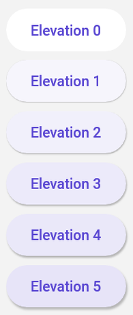

# Material Control Extensions

## Icons

Below is a summary of the icon support for different controls:

| Control         | Icon | LeadingIcon | TrailingIcon |
|-----------------|------|-------------|--------------|
| **Button**      |  ✔️  |     ❌     |      ❌      |
| **Combobox**    |  ✔️  |     ❌     |      ❌      |
| **PasswordBox** |  ✔️  |     ❌     |      ❌      |
| **TextBox**     |  ❌  |     ✔️     |      ✔️      |


This feature allows for the addition of icons on the supported controls. Icons can be added in different positions, such as `Icon`, `LeadingIcon`, and `TrailingIcon`. You can choose from various [`IconElement`](https://docs.microsoft.com/en-us/windows/windows-app-sdk/api/winrt/microsoft.ui.xaml.controls.iconelement)s to represent your icons, including `<BitmapIcon />`, `<FontIcon />`, `<PathIcon />`, or `<SymbolIcon />`.

When using `LeadingIcon` and `TrailingIcon`, you have the additional flexibility of binding commands to them. By utilizing `LeadingCommand` and `TrailingCommand`, you can associate specific actions or functionality with these icons, allowing users to interact with them. This feature is particularly useful when you want to provide distinct actions associated with each icon.

Furthermore, `LeadingIcon` and `TrailingIcon` offer additional control over icon visibility. You can use the properties `IsLeadingIconVisible` and `IsTrailingIconVisible` to dynamically control the visibility of these icons based on specific conditions or user interactions.

> [!WARNING]
> `LeadingIcon` and `TrailingIcon` as well as `LeadingCommand`, `TrailingCommand`, `IsLeadingIconVisible`, `IsTrailingIconVisible` are specifically available for `TextBox` controls. Use `Icon` for other controls such as `PasswordBox`, `ComboBox`, `Button`.

Here are supported control with samples:

* TextBox:

    ```xml
    <TextBox Style="{StaticResource MaterialFilledTextBoxStyle}"
             um:ControlExtensions.LeadingCommand="{Binding MyCommand}">
        <um:ControlExtensions.LeadingIcon>
            <SymbolIcon Symbol="SolidStar" />
        </um:ControlExtensions.LeadingIcon>
    </TextBox>

    <TextBox Style="{StaticResource MaterialFilledTextBoxStyle}"
             um:ControlExtensions.TrailingCommand="{Binding MyCommand}"
             um:ControlExtensions.IsTrailingIconVisible="False">
         <um:ControlExtensions.TrailingIcon>
            <SymbolIcon Symbol="SolidStar" />
        </um:ControlExtensions.TrailingIcon>
    </TextBox>
    ```

* PasswordBox:

    ```xml
    <PasswordBox Style="{StaticResource MaterialFilledPasswordBoxStyle}">
        <um:ControlExtensions.Icon>
            <SymbolIcon Symbol="Favorite" />
        </um:ControlExtensions.Icon>
    </PasswordBox>
    ```

* ComboBox:

    ```xml
    <ComboBox Style="{StaticResource MaterialComboBoxStyle}">
        <um:ControlExtensions.Icon>
            <SymbolIcon Symbol="SolidStar" />
        </um:ControlExtensions.Icon>
    </ComboBox>
    ```

* Button:

    ```xml
    <Button Style="{StaticResource MaterialOutlinedButtonStyle}">
        <um:ControlExtensions.Icon>
            <FontIcon Glyph="&#xE946;" />
        </um:ControlExtensions.Icon>
    </Button>
    ```

## Alternate Content

This feature allows putting different content on a control when the state changes.
It's control specific and for now, you can only use it with the ToggleButton control.

### Alternate Content on ToggleButton

```xml
<ToggleButton Style="{StaticResource MaterialToggleButtonIconStyle}">
    <!-- This is the default content - which is when the control state is UNCHECKED (the default value of a ToggleButton) -->
    <PathIcon Data="{StaticResource Icon_more_horizontal}" />

    <!-- This is the alternate content - which is when the control state is CHECKED -->
    <um:ControlExtensions.AlternateContent>
        <PathIcon Data="{StaticResource Icon_more_vertical}" />
    </um:ControlExtensions.AlternateContent>
</ToggleButton>
```

## Elevation

This feature allows to set the level of elevation to depict on the supported control.

Setting the elevation on [supported controls](#supported-controls) can result in changes to both the shadow and the [surface tint](#surface-tint).

[Material Design Elevation Guidance](https://m3.material.io/styles/elevation/overview)

## Surface Tint

The surface tint properties allow for customization of how elevation can be depicted on certain controls. While the Background of a control remains static, the surface color can change based on the level of elevation.

### TintedBackground

This is a readonly property that will provide a SolidColorBrush depicting the control's current background color overlayed with the surface tint color at a certain opacity based on the elevation of the control.

### IsTintEnabled

This feature allows for enabling or disabling the surface tint that may be applied to an elevated control. When `IsTintEnabled` is `false`, the `TintedBackground` property will remain the same value as the control's background color.

### Example Usage for `Button`

The `ElevatedButtonStyle` in Uno Material supports elevation and surface tints through the use of the `TintedBackground`, `IsTintEnabled`, and `Elevation` attached properties.

`ElevatedButtonStyle` contains the following `Setter`s:

```xml
...

<Setter Property="um:ControlExtensions.Elevation"
        Value="1" />
<Setter Property="um:ControlExtensions.IsTintEnabled"
        Value="True" />
...
```

Within the `ControlTemplate` of the `ElevatedButtonStyle`, instead of performing a `TemplateBinding` to the `Background` property of the `Button`, we instead bind to the `TintedBackground` attached property:

```xml
<Grid x:Name="Root"
      ...
      Background="{Binding Path=(um:ControlExtensions.TintedBackground), RelativeSource={RelativeSource TemplatedParent}}">
      <!-- Remaining content omitted for brevity -->
</Grid>
```

Applying the surface tint for elevated controls is optional and must be explicitly enabled through the use of the `IsTintEnabled` attached property. Below is an example of how an elevated control may appear  with or without a surface tint:

```xml
<StackPanel Spacing="8">
    <Button Content="Elevation 0"
            um:ControlExtensions.Elevation="0"
            Style="{StaticResource MaterialElevatedButtonStyle}" />
    <Button Content="Elevation 1"
            um:ControlExtensions.Elevation="1"
            Style="{StaticResource MaterialElevatedButtonStyle}" />
    <Button Content="Elevation 2"
            um:ControlExtensions.Elevation="2"
            Style="{StaticResource MaterialElevatedButtonStyle}" />
    <Button Content="Elevation 3"
            um:ControlExtensions.Elevation="3"
            Style="{StaticResource MaterialElevatedButtonStyle}" />
    <Button Content="Elevation 4"
            um:ControlExtensions.Elevation="4"
            Style="{StaticResource MaterialElevatedButtonStyle}" />
    <Button Content="Elevation 5"
            um:ControlExtensions.Elevation="5"
            Style="{StaticResource MaterialElevatedButtonStyle}" />
</StackPanel> 
```

The above XAML will produce the following result:



If we were to alter the XAML above and set `um:ControlExtensions.IsTintEnabled="False"` on each of the buttons, we would see elevated buttons without tints:


### Supported Controls

The following control styles have support for surface tint:

| Control | Supporting Styles   |
|---------|---------------------|
| Button  | ElevatedButtonStyle |
