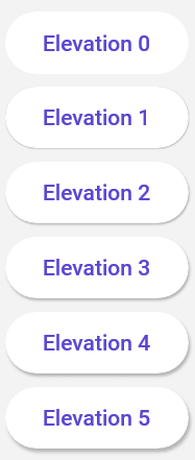

# Material Control Extensions

## Icon

This feature allows for the addition of icon on the supported controls. Those icons could be any of the [`IconElement`](https://docs.microsoft.com/en-us/windows/windows-app-sdk/api/winrt/microsoft.ui.xaml.controls.iconelement)s: `<BitmapIcon />`, `<FontIcon />`, `<PathIcon />` or `<SymbolIcon />`.

Here are supported control with samples:

* TextBox:

    ```xml
    <TextBox Style="{StaticResource MaterialFilledTextBoxStyle}">
        <um:ControlExtensions.Icon>
            <SymbolIcon Symbol="SolidStar" />
        </um:ControlExtensions.Icon>
    </ComboBox>
    ```

* ComboBox:

    ```xml
    <ComboBox Style="{StaticResource MaterialComboBoxStyle}">
        <um:ControlExtensions.Icon>
            <SymbolIcon Symbol="SolidStar" />
        </um:ControlExtensions.Icon>
    </ComboBox>
    ```

## Alternate Content

This feature allows putting different content on a control when the state changes.
It's control specific and for now, you can only use it with the ToggleButton control.

### Alternate Content on ToggleButton

```xml
<ToggleButton Style="{StaticResource MaterialToggleButtonIconStyle}">
    <!-- This is the default content - which is when the control state is UNCHECKED (the default value of a ToggleButton) -->
    <PathIcon Data="{StaticResource Icon_more_horizontal}" />

    <!-- This is the alternate content - which is when the control state is CHECKED -->
    <um:ControlExtensions.AlternateContent>
        <PathIcon Data="{StaticResource Icon_more_vertical}" />
    </um:ControlExtensions.AlternateContent>
</ToggleButton>
```

## Elevation

This feature allows to set the level of elevation to depict on the supported control.

Setting the elevation on [supported controls](#supported-controls) can result in changes to both the shadow and the [surface tint](#surface-tint).

[Material Design Elevation Guidance](https://m3.material.io/styles/elevation/overview)

## Surface Tint

The surface tint properties allow for customization of how elevation can be depicted on certain controls. While the Background of a control remains static, the surface color can change based on the level of elevation.

### TintedBackground

This is a readonly property that will provide a SolidColorBrush depicting the control's current background color overlayed with the surface tint color at a certain opacity based on the elevation of the control.

### IsTintEnabled

This feature allows for enabling or disabling the surface tint that may be applied to an elevated control. When `IsTintEnabled` is `false`, the `TintedBackground` property will remain the same value as the control's background color.

### Example Usage for `Button`

The `ElevatedButtonStyle` in Uno Material supports elevation and surface tints through the use of the `TintedBackground`, `IsTintEnabled`, and `Elevation` attached properties.

`ElevatedButtonStyle` contains the following `Setter`s:

```xml
...

<Setter Property="um:ControlExtensions.Elevation"
        Value="1" />
<Setter Property="um:ControlExtensions.IsTintEnabled"
        Value="True" />
...
```

Within the `ControlTemplate` of the `ElevatedButtonStyle`, instead of performing a `TemplateBinding` to the `Background` property of the `Button`, we instead bind to the `TintedBackground` attached property:

```xml
<Grid x:Name="Root"
      ...
      Background="{Binding Path=(um:ControlExtensions.TintedBackground), RelativeSource={RelativeSource TemplatedParent}}">
      <!-- Remaining content omitted for brevity -->
</Grid>
```

Applying the surface tint for elevated controls is optional and must be explicitly enabled through the use of the `IsTintEnabled` attached property. Below is an example of how an elevated control may appear  with or without a surface tint:

```xml
<StackPanel Spacing="8">
    <Button Content="Elevation 0"
            um:ControlExtensions.Elevation="0"
            Style="{StaticResource MaterialElevatedButtonStyle}" />
    <Button Content="Elevation 1"
            um:ControlExtensions.Elevation="1"
            Style="{StaticResource MaterialElevatedButtonStyle}" />
    <Button Content="Elevation 2"
            um:ControlExtensions.Elevation="2"
            Style="{StaticResource MaterialElevatedButtonStyle}" />
    <Button Content="Elevation 3"
            um:ControlExtensions.Elevation="3"
            Style="{StaticResource MaterialElevatedButtonStyle}" />
    <Button Content="Elevation 4"
            um:ControlExtensions.Elevation="4"
            Style="{StaticResource MaterialElevatedButtonStyle}" />
    <Button Content="Elevation 5"
            um:ControlExtensions.Elevation="5"
            Style="{StaticResource MaterialElevatedButtonStyle}" />
</StackPanel> 
```

The above XAML will produce the following result:


If we were to alter the XAML above and set `um:ControlExtensions.IsTintEnabled="False"` on each of the buttons, we would see elevated buttons without tints:



### Supported Controls

The following control styles have support for surface tint:

| Control | Supporting Styles   |
|---------|---------------------|
| Button  | ElevatedButtonStyle |


## ResourcePathOverride

This extension allows you to set the path of a dictionary in your project for a specific control. It makes [lightweight styling](lightweight-styling.md) easier by enabling controls, like buttons, to link directly to resource dictionaries instead of requiring each resource to be written on the page. This means you can have multiple buttons with the same style but different colors simply by linking them to different resource dictionaries. It also allows for the reuse of these dictionaries across various controls, making the styling process more efficient and manageable.

Here is an example of how LightWeightStyling could be applied could be used on a checkbox.
* CheckBox:

    ```xml
    <CheckBox Content="Overridden checkbox style"
					  Style="{StaticResource MaterialCheckBoxStyle}"
					  um:ControlExtensions.ResourceOverridePath="ms-appx:///ControlResourcesOverride/CheckBox.xaml" />
    ```

* ControlResourcesOverride/CheckBox.xaml content :

    ```xml
    <ResourceDictionary xmlns="http://schemas.microsoft.com/winfx/2006/xaml/presentation"
			    		xmlns:x="http://schemas.microsoft.com/winfx/2006/xaml">

	<!-- Checked state -->
	<SolidColorBrush x:Key="CheckBoxGlyphForegroundChecked"
					 Color="Red" />
	<SolidColorBrush x:Key="CheckBoxBorderBrushChecked"
					 Color="Green" />
	<SolidColorBrush x:Key="CheckBoxBackgroundChecked"
					 Color="White" />

	<!-- Checked and pointer over state -->
	<SolidColorBrush x:Key="CheckBoxGlyphForegroundCheckedPointerOver"
					 Color="Blue" />
	<SolidColorBrush x:Key="CheckBoxBorderBrushCheckedPointerOver"
					 Color="Yellow" />
	<SolidColorBrush x:Key="CheckBoxBackgroundCheckedPointerOver"
					 Color="Black" />

	<!-- Checked and pressed state -->
	<SolidColorBrush x:Key="CheckBoxGlyphForegroundPressed"
					 Color="Purple" />
	<SolidColorBrush x:Key="CheckBoxBorderBrushCheckedPressed"
					 Color="Silver" />
	<SolidColorBrush x:Key="CheckBoxBackgroundCheckedPressed"
					 Color="Cyan" />

	<!-- Unchecked state -->
	<StaticResource x:Key="CheckBoxBorderBrushUnchecked"
					ResourceKey="SecondaryBrush" />
	<StaticResource x:Key="CheckBoxBackgroundUnchecked"
					ResourceKey="PrimaryLowBrush" />

	<!-- Unchecked and pressed state -->
	<SolidColorBrush x:Key="CheckBoxBorderBrushUncheckedPressed"
					 Color="Lime" />
	<SolidColorBrush x:Key="CheckBoxBackgroundUncheckedPressed"
					 Color="Navy" />

	<!-- Unchecked and pointer over state -->
	<SolidColorBrush x:Key="CheckBoxBorderBrushUncheckedPointerOver"
					 Color="Maroon" />
	<SolidColorBrush x:Key="CheckBoxBackgroundUncheckedPointerOver"
					 Color="Olive" />
    </ResourceDictionary>
    ```

