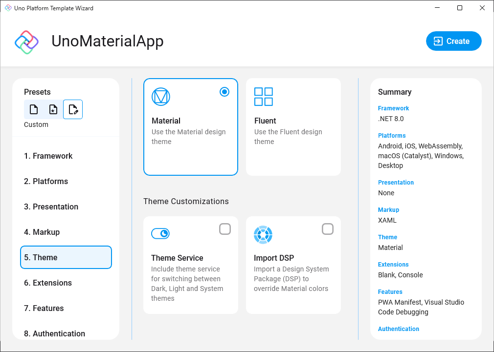
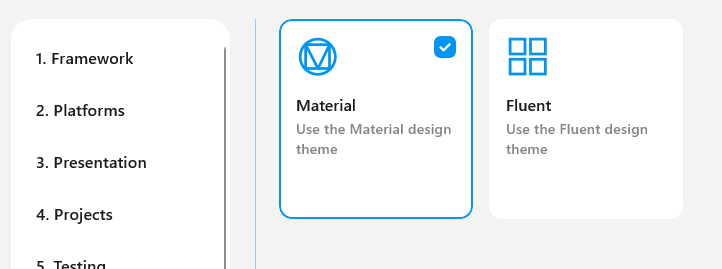

---
uid: Uno.Themes.Material.GetStarted
---

# Uno Material

<p align="center">
  
</p>

The Uno Material library is available as NuGet packages that can be added to any new or existing Uno Platform solution.
Uno Material lets you apply [Material Design 3](https://m3.material.io/) styling to your application with just a few lines of code.

> [!WARNING]
> If you are updating Uno Material to v2 from an older 1.x version of the package, additional steps will be required. Refer to the [Uno Material Migration Guide](material-migration.md).

## Getting Started

Initialization of the Uno Material resources is handled by the specialized `MaterialTheme` ResourceDictionary.

### `MaterialTheme`

#### Constructors

| Constructor                                                                          | Description                                                                                           |
|--------------------------------------------------------------------------------------|-------------------------------------------------------------------------------------------------------|
| `MaterialTheme()`                                                                    | Initializes a new instance of the `MaterialTheme` resource dictionary.                                |
| `MaterialTheme(ResourceDictionary? colorOverride, ResourceDictionary? fontOverride)` | Initializes a new instance of the `MaterialTheme` resource dictionary and applies the given overrides |

#### Properties

| Property              | Type     | Description                                                                                                                                                                         |
|-----------------------|----------|-------------------------------------------------------------------------------------------------------------------------------------------------------------------------------------|
| `ColorOverrideSource` | `string` | (Optional) Gets or sets a Uniform Resource Identifier that provides the source location of a `ResourceDictionary` containing overrides for the default Uno Material Color resources |
| `FontOverrideSource`  | `string` | (Optional) Gets or sets a Uniform Resource Identifier that provides the source location of a `ResourceDictionary` containing overrides for the default Uno Material font resources  |

### Creating a new project with Uno Material

# [**Wizard**](#tab/wizard)

1. Follow the steps in the [Getting Started with Visual Studio](xref:Uno.GettingStarted.CreateAnApp.VS2022#create-the-app) instructions to launch the Uno Platform Template Wizard.
2. Select `Customize` on your preferred template.
3. Select `Material` under the `Theme` section.

    

# [**CLI**](#tab/cli)

1. Install the [`dotnet new` CLI templates](xref:Uno.GetStarted.dotnet-new) with:

```bash
dotnet new install Uno.Templates
```

2. Create a new application with:

```bash
dotnet new unoapp -o UnoMaterialApp -theme material
```

---

### Installing Uno Material in an existing project

Depending on the type of project template that the Uno Platform application was created with, follow the instructions below to install Uno Material.

# [**Single Project Template**](#tab/singleproj)

1. Edit your project file (`PROJECT_NAME.csproj`) and add `Material` to the list of `UnoFeatures`:

    ```xml
    <UnoFeatures>Material</UnoFeatures>
    ```

2. Initialize `MaterialTheme` in the `App.xaml`:

    ```xml
    <Application.Resources>
        <ResourceDictionary>
            <ResourceDictionary.MergedDictionaries>

                <!-- Code ommitted of brevity -->

                <MaterialTheme xmlns="using:Uno.Material" />
            </ResourceDictionary.MergedDictionaries>
        </ResourceDictionary>
    </Application.Resources>
    ```

# [**Multi-Head Project Template**](#tab/multihead)

1. In the Solution Explorer panel, right-click on your app's **App Code Library** project (`PROJECT_NAME.csproj`) and select `Manage NuGet Packages...`
2. Install the [`Uno.Material.WinUI`](https://www.nuget.org/packages/Uno.Material.WinUI)
3. Add the following Material resources to `AppResources.xaml`:

    ```xml
    <ResourceDictionary>
        <ResourceDictionary.MergedDictionaries>

            <!-- Load Uno Material resources -->
            <MaterialTheme xmlns="using:Uno.Material" />

        </ResourceDictionary.MergedDictionaries>
    </ResourceDictionary>
    ```

# [**Shared Project (.shproj) Template**](#tab/shproj)

1. In the Solution Explorer panel, right-click on your solution name and select `Manage NuGet Packages for Solution ...`. Choose either:
     - The [`Uno.Material`](https://www.nuget.org/packages/Uno.Material/) package when targetting Xamarin/UWP
     - The [`Uno.Material.WinUI`](https://www.nuget.org/packages/Uno.Material.WinUI) package when targetting net6.0+/WinUI

2. Select the following projects for installation:
    - `PROJECT_NAME.Wasm.csproj`
    - `PROJECT_NAME.Mobile.csproj` (or `PROJECT_NAME.iOS.csproj`, `PROJECT_NAME.Droid.csproj`, and `PROJECT_NAME.macOS.csproj` if you have an existing project)
    - `PROJECT_NAME.Skia.Gtk.csproj`
    - `PROJECT_NAME.Skia.WPF.csproj`
    - `PROJECT_NAME.Windows.csproj` (or `PROJECT_NAME.UWP.csproj` for existing projects)
3. Add the following resources inside `App.xaml`:

    ```xml
    <Application ...>
        <Application.Resources>
            <ResourceDictionary>
                <ResourceDictionary.MergedDictionaries>

                    <!-- Load WinUI resources -->
                    <XamlControlsResources xmlns="using:Microsoft.UI.Xaml.Controls" />

                    <!-- Load Uno Material resources -->
                    <MaterialTheme xmlns="using:Uno.Material" />

                    <!-- Load custom application resources -->
                    <!-- ... -->

                </ResourceDictionary.MergedDictionaries>
            </ResourceDictionary>
        </Application.Resources>
    </Application>
    ```

---

## Customization

### Color Overrides using _Material Theme Builder_ and DSP format

It is possible to use the [Material Theme Builder](https://m3.material.io/theme-builder#/custom) to generate a custom color palette derived from your own basic colors. The generated palette is provided in the [DSP format](https://m3.material.io/styles/color/the-color-system/color-dsp) and can be used to override the default Uno Material colors.

The tooling required to generate the _Material Colors Override_ file from a DSP package (zip file) will be present by default when creating an Uno Platform application with support for Uno Material from the Wizard.



Follow this link to get [more Information about the DSP tooling](xref:Uno.Material.DSP).

### Manual Color Overrides

Use this when you want to manually override the default color palette from the Uno Material library.

1. Add a new Resource Dictionary named `MaterialColorsOverride.xaml` to the application project, for example, under `Styles/Application`.
2. Replace the content with:

    ```xml
    <ResourceDictionary xmlns="http://schemas.microsoft.com/winfx/2006/xaml/presentation"
                        xmlns:x="http://schemas.microsoft.com/winfx/2006/xaml">
        <ResourceDictionary.ThemeDictionaries>

            <!-- Light Theme -->
            <ResourceDictionary x:Key="Light">
                <!-- Primary -->
                <Color x:Key="PrimaryColor">#6750A4</Color>
                <Color x:Key="PrimaryInverseColor">#D0BCFF</Color>
                <Color x:Key="OnPrimaryColor">#FFFFFF</Color>
                <Color x:Key="PrimaryContainerColor">#EADDFF</Color>
                <Color x:Key="OnPrimaryContainerColor">#21005E</Color>

                <!-- Primary Variant Legacy Colors -->
                <Color x:Key="PrimaryVariantDarkColor">#353FE5</Color>
                <Color x:Key="PrimaryVariantLightColor">#B6A8FB</Color>

                <!-- Secondary -->
                <Color x:Key="SecondaryColor">#625B71</Color>
                <Color x:Key="OnSecondaryColor">#FFFFFF</Color>
                <Color x:Key="SecondaryContainerColor">#E5DFF9</Color>
                <Color x:Key="OnSecondaryContainerColor">#1B192C</Color>

                <!-- Secondary Variant Legacy Colors -->
                <Color x:Key="SecondaryVariantDarkColor">#2BB27E</Color>
                <Color x:Key="SecondaryVariantLightColor">#9CFFDF</Color>

                <!-- Tertiary -->
                <Color x:Key="TertiaryColor">#7D5260</Color>
                <Color x:Key="OnTertiaryColor">#FFFFFF</Color>
                <Color x:Key="TertiaryContainerColor">#FFD8E4</Color>
                <Color x:Key="OnTertiaryContainerColor">#370B1E</Color>

                <!-- Error -->
                <Color x:Key="ErrorColor">#B3261E</Color>
                <Color x:Key="OnErrorColor">#FFFFFF</Color>
                <Color x:Key="ErrorContainerColor">#F9DEDC</Color>
                <Color x:Key="OnErrorContainerColor">#370B1E</Color>

                <!-- Background -->
                <Color x:Key="BackgroundColor">#FFFBFE</Color>
                <Color x:Key="OnBackgroundColor">#1C1B1F</Color>

                <!-- Surface -->
                <Color x:Key="SurfaceColor">#FFFBFE</Color>
                <Color x:Key="OnSurfaceColor">#1C1B1F</Color>
                <Color x:Key="SurfaceVariantColor">#E7E0EC</Color>
                <Color x:Key="OnSurfaceVariantColor">#A5A0AC</Color>
                <Color x:Key="SurfaceInverseColor">#313033</Color>
                <Color x:Key="OnSurfaceInverseColor">#F4EFF4</Color>
                <Color x:Key="SurfaceTintColor">#5946D2</Color>

                <!-- Outline -->
                <Color x:Key="OutlineColor">#79747E</Color>
                <Color x:Key="OutlineVariantColor">#C9C5D0</Color>
            </ResourceDictionary>

            <!-- Dark Theme -->
            <ResourceDictionary x:Key="Dark">
                <!-- Primary -->
                <Color x:Key="PrimaryColor">#D0BCFF</Color>
                <Color x:Key="OnPrimaryColor">#371E73</Color>
                <Color x:Key="PrimaryContainerColor">#4F378B</Color>
                <Color x:Key="OnPrimaryContainerColor">#EADDFF</Color>
                <Color x:Key="PrimaryInverseColor">#6750A4</Color>

                <!-- Primary Variant Legacy Colors -->
                <Color x:Key="PrimaryVariantDarkColor">#353FE5</Color>
                <Color x:Key="PrimaryVariantLightColor">#D4CBFC</Color>

                <!-- Secondary -->
                <Color x:Key="SecondaryColor">#CCC2DC</Color>
                <Color x:Key="OnSecondaryColor">#332D41</Color>
                <Color x:Key="SecondaryContainerColor">#474459</Color>
                <Color x:Key="OnSecondaryContainerColor">#E5DFF9</Color>

                <!-- Secondary Variant Legacy Colors -->
                <Color x:Key="SecondaryVariantDarkColor">#2BB27E</Color>
                <Color x:Key="SecondaryVariantLightColor">#9CFFDF</Color>

                <!-- Tertiary -->
                <Color x:Key="TertiaryColor">#EFB8C8</Color>
                <Color x:Key="OnTertiaryColor">#492532</Color>
                <Color x:Key="TertiaryContainerColor">#633B48</Color>
                <Color x:Key="OnTertiaryContainerColor">#FFD8E4</Color>

                <!-- Error -->
                <Color x:Key="ErrorColor">#F2B8B5</Color>
                <Color x:Key="OnErrorColor">#601410</Color>
                <Color x:Key="ErrorContainerColor">#8C1D18</Color>
                <Color x:Key="OnErrorContainerColor">#F9DEDC</Color>

                <!-- Background -->
                <Color x:Key="BackgroundColor">#1C1B1F</Color>
                <Color x:Key="OnBackgroundColor">#E6E1E5</Color>

                <!-- Surface -->
                <Color x:Key="SurfaceColor">#1C1B1F</Color>
                <Color x:Key="OnSurfaceColor">#E6E1E5</Color>
                <Color x:Key="SurfaceVariantColor">#49454F</Color>
                <Color x:Key="OnSurfaceVariantColor">#CAC4D0</Color>
                <Color x:Key="SurfaceInverseColor">#E6E1E5</Color>
                <Color x:Key="OnSurfaceInverseColor">#313033</Color>
                <Color x:Key="SurfaceTintColor">#C7BFFF</Color>

                <!-- Outline -->
                <Color x:Key="OutlineColor">#938F99</Color>
                <Color x:Key="OutlineVariantColor">#57545D</Color>
            </ResourceDictionary>

        </ResourceDictionary.ThemeDictionaries>
    </ResourceDictionary>
    ```

3. In `App.xaml`, update `<MaterialTheme />` with the override from the previous steps:

    ```xml
    <MaterialTheme xmlns="using:Uno.Material"
                   ColorOverrideSource="ms-appx:///Styles/Application/MaterialColorsOverride.xaml" />
    ```

### Change Default Font

By default, Uno Material comes pre-packaged with the [Roboto](https://fonts.google.com/specimen/Roboto) font families and automatically includes them in your application. Upon installation of the Uno Material package, you will have the following resources available: `MaterialLightFontFamily`, `MaterialRegularFontFamily`, and `MaterialMediumFontFamily`.

If you would like Uno Material to use a different font, you can override the default font families following these steps:

1. Add the custom font following [Custom Fonts documentation](https://platform.uno/docs/articles/features/custom-fonts.html).
2. Add a new Resource Dictionary named `MaterialFontsOverride.xaml` to the application project, for example, under `Styles/Application`.
3. Assuming the font file has been placed in a directory such as `Assets/Fonts/MyCustomFont.ttf`, your override file would look like the following:

    ```xml
    <ResourceDictionary xmlns="http://schemas.microsoft.com/winfx/2006/xaml/presentation"
                        xmlns:x="http://schemas.microsoft.com/winfx/2006/xaml">

        <FontFamily x:Key="MaterialLightFontFamily">ms-appx:///Assets/Fonts/MyCustomFont.ttf#MyCustomFont</FontFamily>
        <FontFamily x:Key="MaterialMediumFontFamily">ms-appx:///Assets/Fonts/MyCustomFont.ttf#MyCustomFont</FontFamily>
        <FontFamily x:Key="MaterialRegularFontFamily">ms-appx:///Assets/Fonts/MyCustomFont.ttfMyCustomFont</FontFamily>

    </ResourceDictionary>
    ```

4. In the `App.xaml`, update `<MaterialTheme />` with the override from the previous steps:

    ```xml
    <MaterialTheme xmlns="using:Uno.Material"
                   FontOverrideSource="ms-appx:///Styles/Application/MaterialFontsOverride.xaml" />
    ```

## Using C# Markup

Uno Material also has support for C# Markup through a [Uno.Material.WinUI.Markup](https://www.nuget.org/packages/Uno.Material.WinUI.Markup) NuGet Package.

To get started with Uno Material in your C# Markup application, add the `Uno.Material.WinUI.Markup` NuGet package to your **App Code Library** project and your platform heads.
Then, add the following code to your `App.cs`:

```csharp
using Uno.Material.Markup;

this.Build(r => r.UseMaterial(
     //optional
     new Styles.ColorPaletteOverride(),
     //optional
     new Styles.MaterialFontsOverride()));
```

## Additional Resources

- [Uno Platform Material Sample App](https://aka.platform.uno/unomaterial-sampleapp)
- [Uno Platform Material Figma File](https://aka.platform.uno/uno-figma-material-toolkit)
- [Official Material Design 3 Guidelines](https://m3.material.io/components)
- [Official Material Design 3 Theme Builder](https://m3.material.io/theme-builder)
