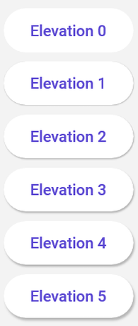

# Control Extensions

Starting on version 5.0.0 the `ControlExtensions` are available on the `Uno.Themes` namespace, so to use that in xaml you should add the following xmlns to your project:

`xmlns:ut="using:Uno.Themes"`

> [!INFO]
> For more information about see our [migration docs](material-migration.md).

## Icon

This feature allows for the addition of icon on the supported controls. Those icons could be any of the [`IconElement`](https://learn.microsoft.com/windows/windows-app-sdk/api/winrt/microsoft.ui.xaml.controls.iconelement)s: `<BitmapIcon />`, `<FontIcon />`, `<PathIcon />`, or `<SymbolIcon />`.

Here are supported control with samples:

* TextBox:

    ```xml
    <TextBox Style="{StaticResource MaterialFilledTextBoxStyle}">
        <ut:ControlExtensions.Icon>
            <SymbolIcon Symbol="SolidStar" />
        </ut:ControlExtensions.Icon>
    </ComboBox>
    ```

* ComboBox:

    ```xml
    <ComboBox Style="{StaticResource MaterialComboBoxStyle}">
        <ut:ControlExtensions.Icon>
            <SymbolIcon Symbol="SolidStar" />
        </ut:ControlExtensions.Icon>
    </ComboBox>
    ```

## Alternate Content

This feature allows putting different content on a control when the state changes.
It's control specific and for now, you can only use it with the `ToggleButton` control.

### Alternate Content on ToggleButton

```xml
<ToggleButton Style="{StaticResource MaterialToggleButtonIconStyle}">
    <!-- This is the default content - which is when the control state is UNCHECKED (the default value of a ToggleButton) -->
    <PathIcon Data="{StaticResource Icon_more_horizontal}" />

    <!-- This is the alternate content - which is when the control state is CHECKED -->
    <ut:ControlExtensions.AlternateContent>
        <PathIcon Data="{StaticResource Icon_more_vertical}" />
    </ut:ControlExtensions.AlternateContent>
</ToggleButton>
```

## Elevation

This feature allows to set the level of elevation to depict on the supported control.

Setting the elevation on [supported controls](#supported-controls) can result in changes to shadow.

[Material Design Elevation Guidance](https://m3.material.io/styles/elevation/overview)

### Example Usage for `Button`

The `ElevatedButtonStyle` in Uno Material supports elevation through the use of the `Elevation` attached property.

`ElevatedButtonStyle` contains the following `Setter`s:

```xml
...

<Setter Property="ut:ControlExtensions.Elevation"
        Value="1" />
...
```

Below is an example of how an elevated control may appear:

```xml
<StackPanel Spacing="8">
    <Button Content="Elevation 0"
            ut:ControlExtensions.Elevation="0"
            Style="{StaticResource MaterialElevatedButtonStyle}" />
    <Button Content="Elevation 1"
            ut:ControlExtensions.Elevation="1"
            Style="{StaticResource MaterialElevatedButtonStyle}" />
    <Button Content="Elevation 2"
            ut:ControlExtensions.Elevation="2"
            Style="{StaticResource MaterialElevatedButtonStyle}" />
    <Button Content="Elevation 3"
            ut:ControlExtensions.Elevation="3"
            Style="{StaticResource MaterialElevatedButtonStyle}" />
    <Button Content="Elevation 4"
            ut:ControlExtensions.Elevation="4"
            Style="{StaticResource MaterialElevatedButtonStyle}" />
    <Button Content="Elevation 5"
            ut:ControlExtensions.Elevation="5"
            Style="{StaticResource MaterialElevatedButtonStyle}" />
</StackPanel>
```

The above XAML will produce the following result:



### Supported Controls

The following control styles have support for elevation:

| Control  | Supporting Styles     |
|----------|-----------------------|
| `Button` | `ElevatedButtonStyle` |
|----------|-----------------------|
