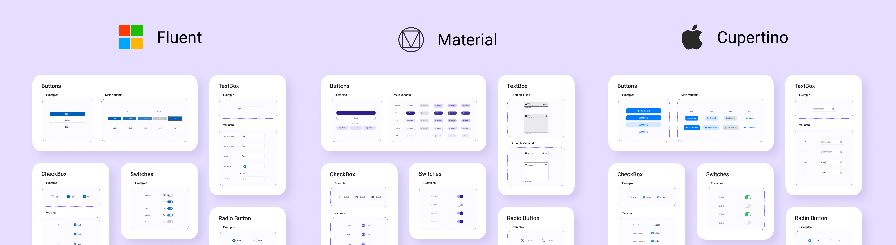

# Themes Overview

  

> [!IMPORTANT]
> UnoFeatures: **Material**, **Cupertino**, or **SimpleTheme** — enable these themes by adding `<UnoFeatures>Material</UnoFeatures>`, `<UnoFeatures>Cupertino</UnoFeatures>`, or `<UnoFeatures>SimpleTheme</UnoFeatures>` to your app's `.csproj`.

## Summary

- [Material Overview](material-getting-started.md)
- [Cupertino Overview](cupertino-getting-started.md)
- [Simple Overview](simple-getting-started.md)
- [Fluent Overview](fluent-getting-started.md)

## Uno Themes Styles

[Uno Themes](https://github.com/unoplatform/Uno.Themes) is the repository for add-ons enabled through UnoFeatures that can be added to any new or existing Uno solution.

It contains four libraries:

- `Uno Themes`: a library that contains the base resources, extensions, and helper classes for the different design system libraries
- `Uno Material`: a library that contains styles following the [Material 3](https://m3.material.io/) Design System
- `Uno Cupertino`: a library that contains styles following the [Human Interface Guidelines](https://developer.apple.com/design/human-interface-guidelines)
- `Uno Simple`: a library that contains styles following the [Figma Simple Design System](https://www.figma.com/community/file/1380235722331273046)

`Material`, `Cupertino`, and `Simple` libraries help you style your application with a few lines of code including:

- Color system for both Light and Dark themes
- Styles for existing WinUI controls like Buttons, TextBox, etc.

## Fluent Controls Styles

Uno Platform 3.0 and above supports control styles conforming to the [Fluent design system](https://www.microsoft.com/design/fluent).
